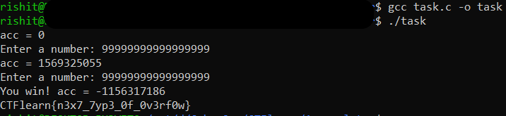

## AndhraPradesh Assembler Chall
The main idea finding the flag using buffer overflow technique.

#### Step-1:
We are given `task.c` which has C code which essentially is used to fetch the flag.

```c
...
	int acc = 0;
	int n;
	while (acc >= 0){
		printf("acc = %d\n", acc);
		printf("Enter a number: ");

		if (scanf("%d", &n) != 1){
			puts("Error reading integer");
		} else {
			if (n < 0){
				puts("You can't enter the negative number!");
			} else {
				acc += n;
			}
		}
	}
	
    printf("You win! acc = %d\n", acc);
...
```

#### Step-2:
By manipulating the value of `n`, the value of `acc` varies and that is what we have to exploit. After finding an optimum `n` after some trial and error, we find that for the value `n = 99999999999999999`, the `acc` variable overflows.

#### Step-3:
The final execution can be shown as below. 



#### Step-4:
Finally the flag becomes:
`CTFlearn{n3x7_7yp3_0f_0v3rf0w}`