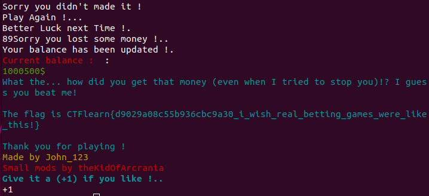

## Lazy Game Challenge
The main idea finding the flag is thinking differently to break the logic in binary file.

#### Step-1:
After pwning into the given machine: `nc thekidofarcrania.com 10001`, we are asked to play a betting game.

#### Step-2:
I input <strong>Y</strong> and proceed to see the game. According to given scenario, I seemed to lose every bet of 100$. So I had to do something differently.

#### Step-3:
This time I placed a bet of a hefty number like `$1000000` which I didn't even possess. I spit out errors. :worried:

#### Step-4:
But the main idea in pwning lies in abnormal thinking and that's where you focus. I tried out negative number this time for the bet like -100000$. I still could play, it shows there was a program logic flaw there.

Now I went wild to give all numbers (which I had to guess below 10) greater than 10. Finally it gave me flag.

#### Step-5:
Finally the flag becomes:
`CTFlearn{d9029a08c55b936cbc9a30_i_wish_real_betting_games_were_like_this!}`
