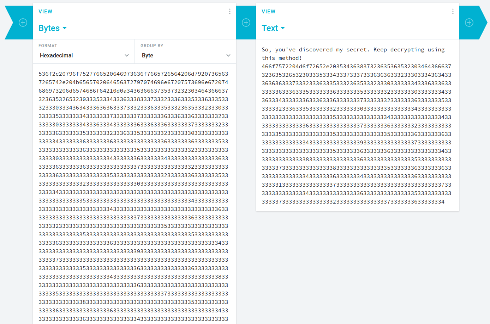
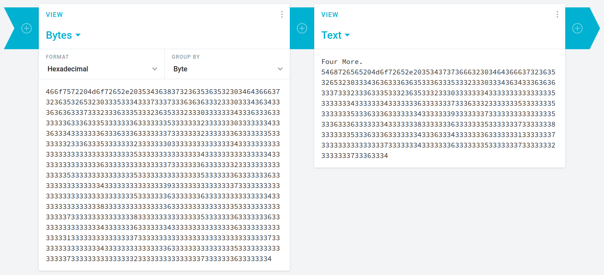
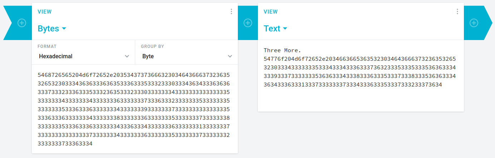
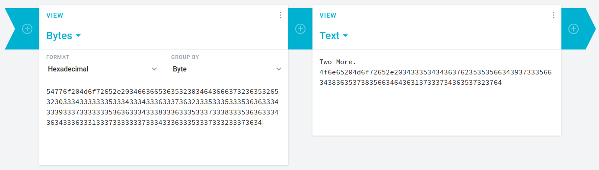
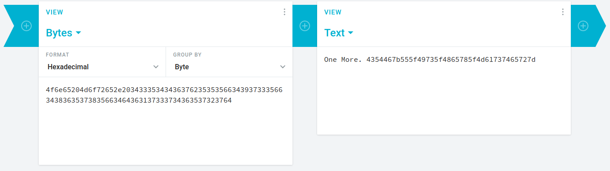
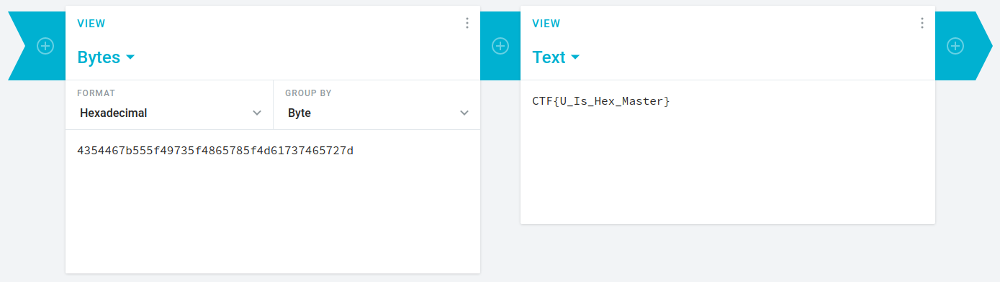

## 3's or 16's? Don't Ask Me!
The main idea finding the flag is multiple Hexadecimal Decryption.

#### Step-1:
After I downloaded `3's or 16's.txt`, it had this:

```
536f2c20796f7527766520646973636f7665726564206d79207365637265742e204b6565702064656372797074696e67207573696e672074686973206d6574686f64210d0a3436366637353732323034643666373236353265323033353334333633383337333233363335333633353332333033343634333636363337333233363335333236353332333033333335333333343333333733333337333333363336333633333332333333303333333433363334333333363336333633333337333333323333333633333335333333323336333533333332333333303333333333333334333333363333333633333333333333363333333633333335333333333333333633333333333333353333333333333332333333333333333033333333333333343333333633333334333333333333333633333336333333363333333333333337333333333333333233333333333333363333333333333335333333333333333233333336333333353333333333333332333333333333333033333333333333333333333333333334333333333333333333333333333333333333333333333333333333333333333533333333333333333333333333333334333333333333333333333333333333343333333333333333333333333333333633333333333333333333333333333337333333333333333633333333333333323333333333333333333333333333333533333333333333333333333333333335333333333333333333333333333333353333333333333336333333333333333633333333333333333333333333333334333333333333333333333333333333393333333333333333333333333333333733333333333333333333333333333333333333333333333333333333333333353333333333333336333333333333333633333333333333333333333333333334333333333333333333333333333333383333333333333333333333333333333633333333333333333333333333333335333333333333333333333333333333373333333333333333333333333333333833333333333333333333333333333335333333333333333633333333333333363333333333333333333333333333333433333333333333363333333333333334333333333333333333333333333333363333333333333333333333333333333133333333333333333333333333333337333333333333333333333333333333333333333333333333333333333333333733333333333333333333333333333334333333333333333333333333333333363333333333333333333333333333333533333333333333333333333333333337333333333333333333333333333333323333333333333333333333333333333733333333333333363333333333333334
```

#### Step-2:
Clearly, it was encoded in Hexadecimal, so I decrypted it at: https://cryptii.com/pipes/hex-decoder

I got this:
```
So, you've discovered my secret. Keep decrypting using this method!
466f7572204d6f72652e203534363837323635363532303464366637323635326532303335333433373337333636363332333033343634333636363337333233363335333236353332333033333334333633363333333633363335333333363333333533333332333333303333333433363334333333363336333633333337333333323333333633333335333333323336333533333332333333303333333333333334333333333333333333333333333333353333333333333334333333333333333433333333333333363333333333333337333333363333333233333333333333353333333333333335333333333333333533333336333333363333333333333334333333333333333933333333333333373333333333333333333333333333333533333336333333363333333333333334333333333333333833333333333333363333333333333335333333333333333733333333333333383333333333333335333333363333333633333333333333343333333633333334333333333333333633333333333333313333333333333337333333333333333333333333333333373333333333333334333333333333333633333333333333353333333333333337333333333333333233333333333333373333333633333334
```



#### Step-3:
Now it says to go on. (That's What she said ;)). So did I.
It gave this:
```
Four More. 
5468726565204d6f72652e2035343737366632303464366637323635326532303334363633363635333633353332333033343634333636363337333233363335333236353332333033333334333333333333333533333334333333343333333633333337333633323333333533333335333333353336333633333334333333393333333733333333333333353336333633333334333333383333333633333335333333373333333833333335333633363333333433363334333333363333333133333337333333333333333733333334333333363333333533333337333333323333333733363334
```


Next time,
I got this:

```
Three More. 
54776f204d6f72652e2034663665363532303464366637323635326532303334333333353334333433363337363233353335333536363334333933373333333536363334333833363335333733383335363633343634333633313337333333373334333633353337333233373634
```




Next time,
I got this:

```
Two More. 
4f6e65204d6f72652e2034333534343637623535356634393733356634383635373835663464363137333734363537323764
```



Next time,
I got this:

```
One More. 4354467b555f49735f4865785f4d61737465727d
```



Finally,
I got this:

```
CTF{U_Is_Hex_Master}
```



#### Step-5:
Finally the flag becomes: 
`CTF{U_Is_Hex_Master}`