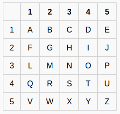

## 5x5 Crypto
The main idea finding the flag is by simple pairs.

#### Step-1:
After reading the given text:

`Ever heard of the 5x5 secret message system? If not, basically it's a 5x5 grid with all letters of the alphabet in order, without k because c is represented to make the k sound only. Google it if you need to. A letter is identified by Row-Column. All values are in caps. Try: 1-3,4-4,2-1,{,4-4,2-3,4-5,3-2,1-2,4-3,_,4-5,3-5,}`

#### Step-2:
So, basically the table is:



We can decode the message according to given inputs in message above to get the flag.

#### Step-3:
Instead I wrote a `Flag.py` script to get the flag.

```py
import numpy as np

arr = np.arange(65,90).reshape(5, 5) # Array of alphabet
arr = np.where(arr <75, arr, arr+1)  # Array without 'K' 

cells = ["1-3","4-4","2-1","{","4-4","2-3","4-5","3-2","1-2","4-3","_","4-5","3-5","}"] 
for i in cells:
	if(ord(i[0])>=48 and ord(i[0])<=57):
		x=int(i[0])-1
		y=int(i[2])-1
		print(chr(arr[x][y]),end="")
	else:
		print(i[0],end="")
print("\n")
```

#### Step-4:

If we execute this script by `python3 Flag.py`, I got the following output:

```bash
CTF{THUMBS_UP}
```
#### Step-5:

Finally the flag becomes:
`CTF{THUMBS_UP}`
