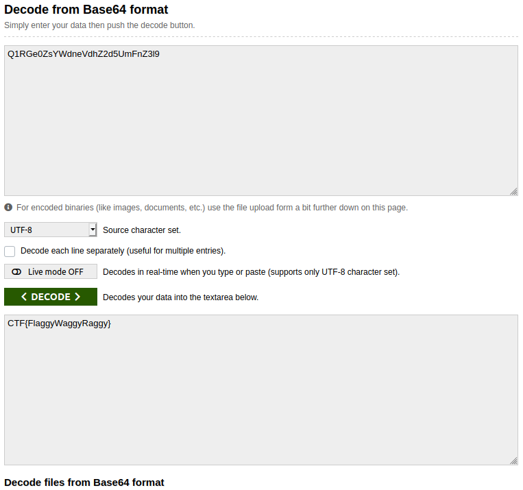

## Base 2 2 the 6
The main idea finding the flag is $2^6$ = 64.

#### Step-1:
After we read the message given,

`Q1RGe0ZsYWdneVdhZ2d5UmFnZ3l9`

It is clearly Base64 encrypted.

#### Step-2:
I tried to decode it online here: https://www.base64decode.org/

I got the following result:

#### Step-3:
Finally the flag becomes:
`CTF{FlaggyWaggyRaggy}`