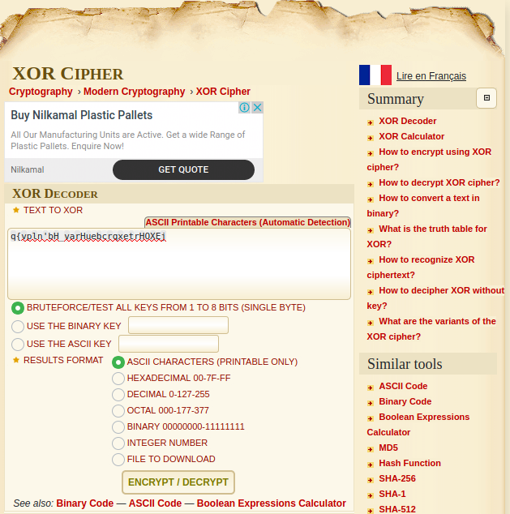
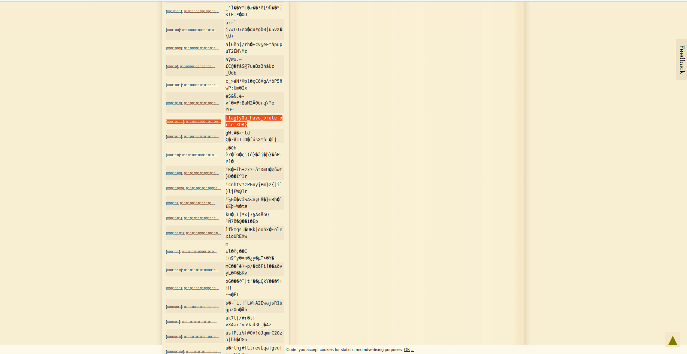

## BruXOR
The main idea finding the flag is XOR Bruteforce.

#### Step-1:
After reading the message in the question,

`There is a technique called bruteforce. Message: q{vpln'bH_varHuebcrqxetrHOXEj No key! Just brute .. brute .. brute ... :D`

The first thing I searched online was XOR Bruteforce and I got some helpful results.

#### Step-2:
I followed the URL:  https://www.dcode.fr/xor-cipher

Since in the message, it is clearly that there is no key, my inputs were as follows: (Only Bruteforce xP)

#### Step-3:
After decrypting, we get the following results, amidst which I found the flag.

#### Step-4:
Finally the flag becomes:
`flag{y0u_Have_bruteforce_XOR}`
