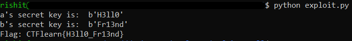

## Defying Hell
The main idea finding the flag using number theory.

#### Step-1:
We are given `data.txt` which is as follows:

```txt
p: 0x8c5378994ef1b
g: 0x02

A: 0x269beb3b0e968
B: 0x4757336da6f70
```

#### Step-2:
The above given variables of `p`, `g`, `A` and `B` are converted to decimal values as it is a logarithmic approach towards similar cryptographic encryption structure of Diffie–Hellman Key Exchange and then used to write the script named `exploit.py` which is as follows:

```py
import math
from sympy.ntheory.residue_ntheory import discrete_log

p = 2468642135797531
g = 2

# A = g^{a} mod p where a is the secret integer of Alice
A = 679217732839784
# B = g^{b} mod p where b is the secret integer of Bob
B = 1255037608816496

# Find an integer x in [1, p-1] s.t. g^{x} = A mod p and g^{x} = B mod p.
# Note that the complexity of this computation is exponential as it is the discrete logarithm problem.
x = discrete_log(p, A, 2)
y = discrete_log(p, B, 2)

if (pow(2, x, p) == A):
	a = x

if (pow(2, y, p) == B):
	b = y

# Compute the secret common key to verify correct keys
k_a = pow(B, a, p)
k_b = pow(A, b, p)
# Note that k = k_a = k_b
k = k_a 

fa_bytes = bytes.fromhex(hex(a)[2:])
fb_bytes = bytes.fromhex(hex(b)[2:])

print("a's secret key is: ", fa_bytes)
print("b's secret key is: ", fb_bytes)
print("Flag: CTFlearn{" + str(fa_bytes.decode()) + "_" + str(fb_bytes.decode()) + "}")
```

#### Step-3:
After executing the above script by command `python exploit.py`, we get the flag which is shown as follows:



#### Step-4:
Finally the flag becomes:
`CTFlearn{H3ll0_Fr13nd}`