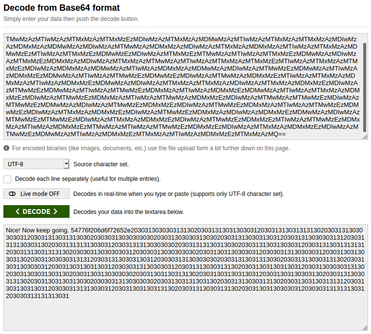
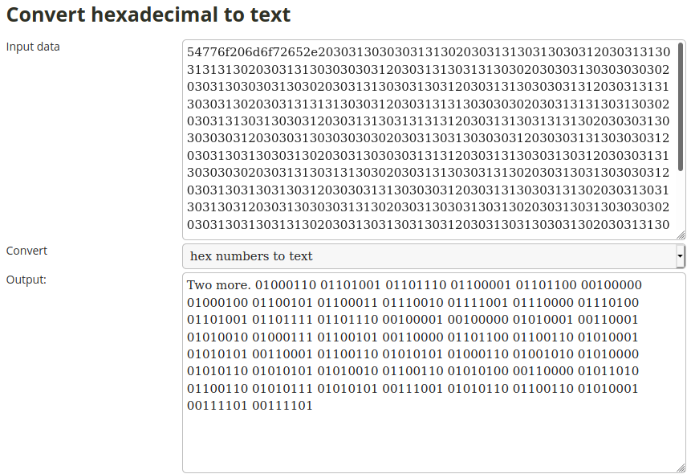
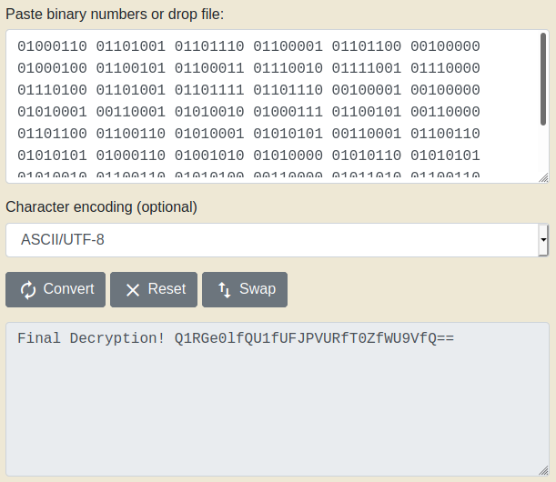
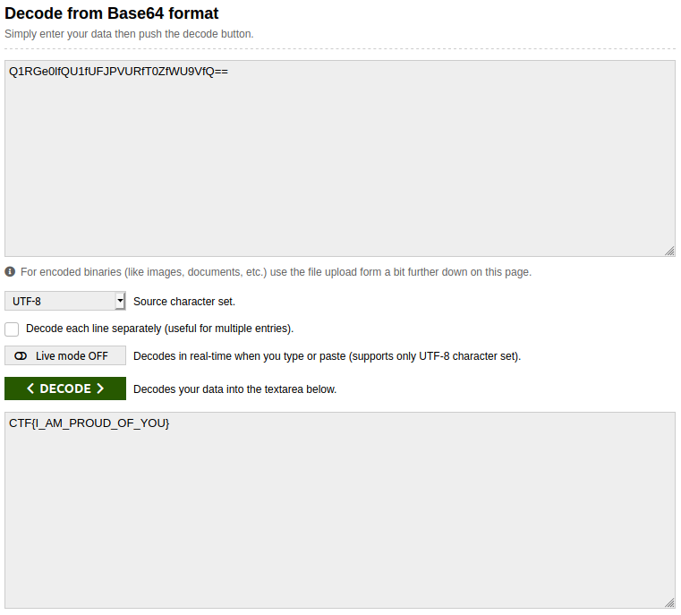

## Encryption Master
The main idea of finding the flag is multiple Decryption.

##### Still no idea, why this question was in Hard section.


#### Step-1:
After I downloading `Here ya go!.txt`, I saw the contents and got,

```
This is NOT going to be fun.
TmljZSEgTm93IGtlZXAgZ29pbmcuIDU0Nzc2ZjIwNmQ2ZjcyNjUyZTIwMzAzMTMwMzAzMDMxMzEzMDIwMzAzMTMxMzAzMTMwMzAzMTIwMzAzMTMxMzAzMTMxMzEzMDIwMzAzMTMxMzAzMDMwMzAzMTIwMzAzMTMxMzAzMTMxMzAzMDIwMzAzMDMxMzAzMDMwMzAzMDIwMzAzMTMwMzAzMDMxMzAzMDIwMzAzMTMxMzAzMDMxMzAzMTIwMzAzMTMxMzAzMDMwMzEzMTIwMzAzMTMxMzEzMDMwMzEzMDIwMzAzMTMxMzEzMTMwMzAzMTIwMzAzMTMxMzEzMDMwMzAzMDIwMzAzMTMxMzEzMDMxMzAzMDIwMzAzMTMxMzAzMTMwMzAzMTIwMzAzMTMxMzAzMTMxMzEzMTIwMzAzMTMxMzAzMTMxMzEzMDIwMzAzMDMxMzAzMDMwMzAzMTIwMzAzMDMxMzAzMDMwMzAzMDIwMzAzMTMwMzEzMDMwMzAzMTIwMzAzMDMxMzEzMDMwMzAzMTIwMzAzMTMwMzEzMDMwMzEzMDIwMzAzMTMwMzAzMDMxMzEzMTIwMzAzMTMxMzAzMDMxMzAzMTIwMzAzMDMxMzEzMDMwMzAzMDIwMzAzMTMxMzAzMTMxMzAzMDIwMzAzMTMxMzAzMDMxMzEzMDIwMzAzMTMwMzEzMDMwMzAzMTIwMzAzMTMwMzEzMDMxMzAzMTIwMzAzMDMxMzEzMDMwMzAzMTIwMzAzMTMxMzAzMDMxMzEzMDIwMzAzMTMwMzEzMDMxMzAzMTIwMzAzMTMwMzAzMDMxMzEzMDIwMzAzMTMwMzAzMTMwMzEzMDIwMzAzMTMwMzEzMDMwMzAzMDIwMzAzMTMwMzEzMDMxMzEzMDIwMzAzMTMwMzEzMDMxMzAzMTIwMzAzMTMwMzEzMDMwMzEzMDIwMzAzMTMxMzAzMDMxMzEzMDIwMzAzMTMwMzEzMDMxMzAzMDIwMzAzMDMxMzEzMDMwMzAzMDIwMzAzMTMwMzEzMTMwMzEzMDIwMzAzMTMxMzAzMDMxMzEzMDIwMzAzMTMwMzEzMDMxMzEzMTIwMzAzMTMwMzEzMDMxMzAzMTIwMzAzMDMxMzEzMTMwMzAzMTIwMzAzMTMwMzEzMDMxMzEzMDIwMzAzMTMxMzAzMDMxMzEzMDIwMzAzMTMwMzEzMDMwMzAzMTIwMzAzMDMxMzEzMTMxMzAzMTIwMzAzMDMxMzEzMTMxMzAzMQ==
```

#### Step-2:
Ending with '==', Base64 aah.



#### Step-3:

It was just hexadecimal text and I decrypted it.



#### Step-4:
It was binary again. So decrypted that also.



#### Step-5:
Finally again Base64. Looked small. Hoped it would be flag.



#### Step-6:
Finally, the flag becomes: 
`CTF{I_AM_PROUD_OF_YOU}`