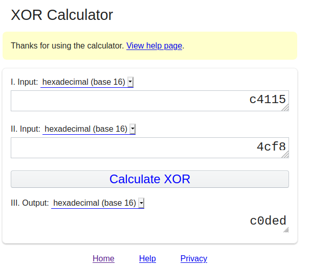

## Hextroadinary

The main idea finding the flag is to read the question properly and interpret.

#### Step-1:

After we read the given message:

`Meet ROXy, a coder obsessed with being exclusively the worlds best hacker. She specializes in short cryptic hard to decipher secret codes. The below hex values for example, she did something with them to generate a secret code, can you figure out what? Your answer should start with 0x.`

`0xc4115` `0x4cf8`

#### Step-2:

`Meet ROXy` - This should give us a simple idea that we have to XOR the 2 given Hex numbers.

#### Step-3:

So I tried it online here:

http://xor.pw/#

Note: Do not forget `0x` before flag.

#### Step-7:
Finally the flag becomes:
`CTFlearn{0xc0ded}`