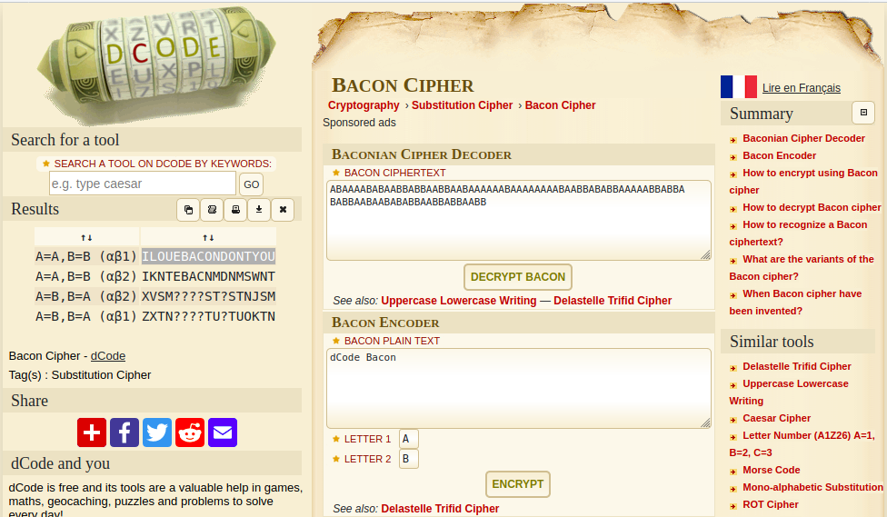

## HyperStream Test #2
The main idea finding the flag is to know Baconian Cipher.

#### Step-1:
After reading the challenge properly, 

```
I love the smell of bacon in the morning! 

ABAAAABABAABBABBAABBAABAAAAAABAAAAAAAABAABBABABBAAAAABBABBABABBAABAABABABBAABBABBAABB 
```
#### Step-2:
It is clear that it has to be Baconian Cipher. Those who are unaware of it, can refer here:
https://en.wikipedia.org/wiki/Bacon%27s_cipher

I then quickly looked for online Baconian Cipher decoders.

#### Step-3:
I followed URL: https://www.dcode.fr/bacon-cipher.

I got the following results:



#### Step-4:
Finally the flag becomes:
`ILOUEBACONDONTYOU`