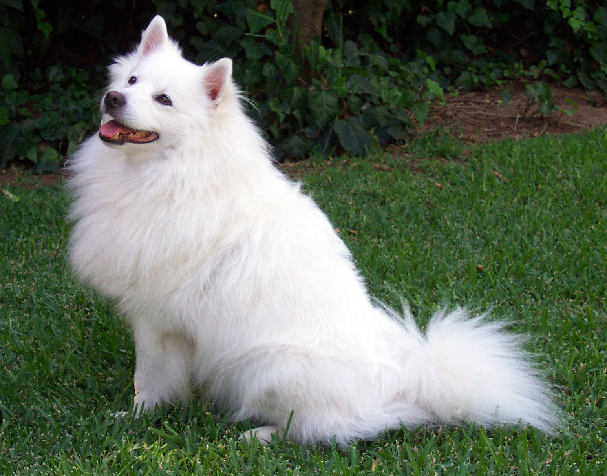
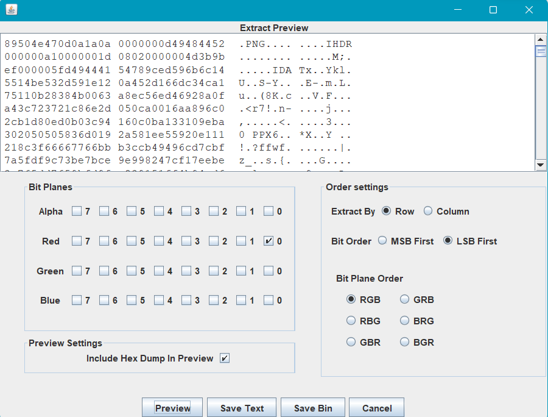
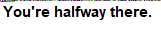
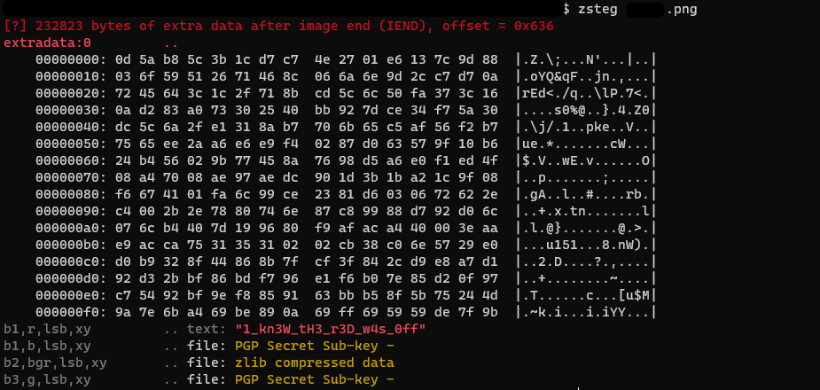

## Image Editing
The main idea finding the flag analyzing the image through steganography tools.

#### Step-1:
After we download `final.png` from the cloud, we see the following:

#### Step-2:
We proceed by putting it through Stegsolve tool [here](https://wiki.bi0s.in/steganography/stegsolve/). 

#### Step-3:
By choosing what option we need by basing on zsteg return on that image `b1`, `r`, `lsb`, `xy` (`b1` for the byte, `r` is for red color, `lsb` algorithm, `xy` position of image we can receive) and we extract there.

#### Step-4:
We save that image with `.png` format because look on the text of the hex file and PNG is the first thing visible.

#### Step-5:
We then just run the command `zsteg <imageName>.png` [reference](https://wiki.bi0s.in/steganography/zsteg/) to get the final flag as follows:

#### Step-6:
Finally the flag becomes:
`CTFlearn{1_kn3W_tH3_r3D_w4s_0ff}`