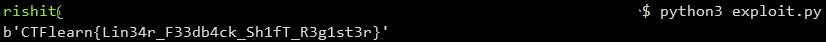

## Linear-feedback. Shift. Register.
The main idea finding the flag analyzing XOR logic.

#### Step-1:
After we download `PRNG.zip` from the cloud, we see the files `description.png` (as shown below) and `secretMessage.hex`:


#### Step-2:
Each character in cipher text is result of `plain[i] ^ result[i-1]`, so `cipher[i]^plain[i]` gives `result[i-1]`. The algorithm XOR every MSB positions in previous result except the first character in plain text, MSB (Most Significant Bit) positions are fixed for every characters in plain text. By analyzing the binary format of positional result (as follows based on initial part of the flag `CTFlearn{`) we see that positions to get most significant bit are `6`, `5`, `3`, `2` and `0`. 

```python
00000101   # C
00000010   # T
00000001   # F
10000000   # l
01000000   # e
10100000   # a
11010000   # r
11101000   # n
11110100   # {
```
#### Step-3:
With this we can write a small script `exploit.py` where we can include the above logic to get the flag.

```py
#!/usr/bin/env python3

def msb(num, pos):
    ret = (num & (1 << pos[0])) >> pos[0]
    for p in pos[1:]:
        ret ^= (num & (1 << p)) >> p
    return ret

def get_next(last, pos):
    m = msb(last, pos)
    return (m << 7)|(last >> 1)

def decode():
    msb_pos = [6,5,3,2,0]
    last = 0
    last = prefix[-1] ^ cipher[len(prefix)-1]

    output=''
    
    for i in range(len(prefix), len(cipher)):
        last = get_next(last, msb_pos)
        output += chr(cipher[i] ^ last)
        
    print(prefix + output.encode())

cipher = open('secretMessage.hex', 'rb').read()
prefix = b"CTFlearn{"

decode()
```

#### Step-4:
We execute the above script with command `python3 exploit.py` to get the flag as follows:



#### Step-5:
Finally the flag becomes:
`CTFlearn{Lin34r_F33db4ck_Sh1fT_R3g1st3r}`