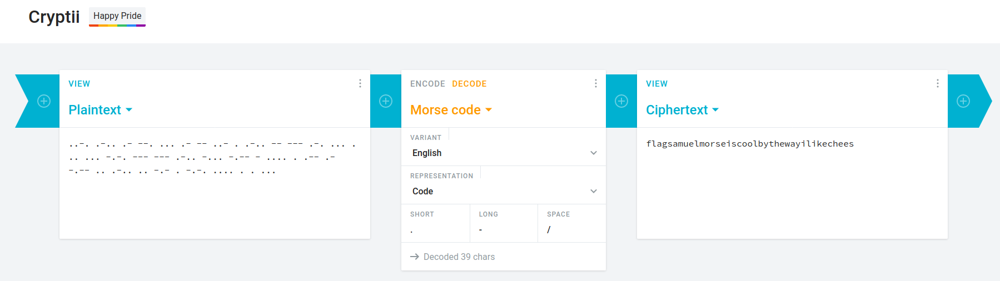

## Morse Code
The main idea finding the flag is just having knowledge about Morse Code.

#### Step-1:

This is the message given to us:

`..-. .-.. .- --. ... .- -- ..- . .-.. -- --- .-. ... . .. ... -.-. --- --- .-.. -... -.-- - .... . .-- .- -.-- .. .-.. .. -.- . -.-. .... . . ...`

#### Step-2:
I used this URL to decode our answer:
https://cryptii.com/pipes/morse-code-to-text

#### Step-3:
This was my output:

That's it. That's our flag.

#### Step-4:

Finally the flag becomes:
`flagsamuelmorseiscoolbythewayilikechees`