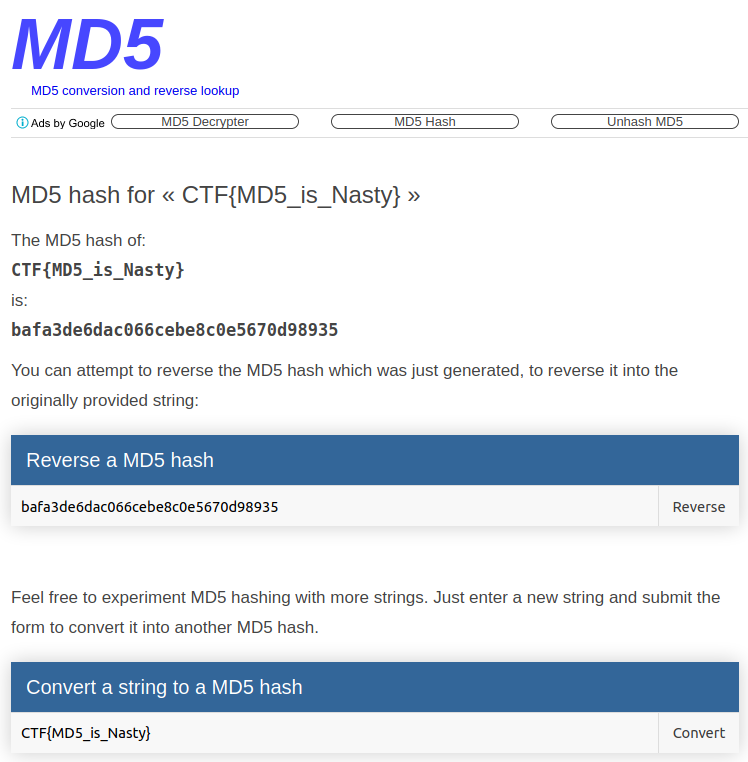

## Nasty Little Doctorses!
The main idea finding the flag is simple Google search.

#### Step-1:
After I read the hash: `bafa3de6dac066cebe8c0e5670d98935`, I tried to decrypt using MD-5 hash database.
But turns out it was reverse hash. What to do now?

#### Step-2:
For random results to trail on, I searched on Google, and luckily got the flag in top searches.

https://md5.gromweb.com/?string=CTF%7BMD5_is_Nasty%7D

###### Dunno, why this challenge was in Hard?

#### Step-3:
Finally the flag becomes: 
`CTF{MD5_is_Nasty}`