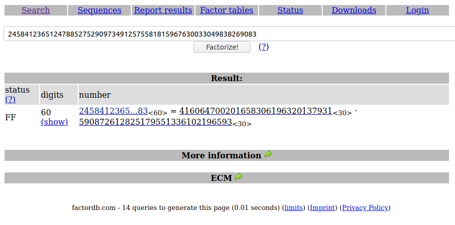

## RSA Noob
The main idea finding the flag using RSA function and its operations.

#### Step-1:
After we download `rsanoob(1).txt` from the cloud, we try to understand what is the content.

If anyone is unaware of RSA Encryption, they can checkout here:

https://en.wikipedia.org/wiki/RSA_(cryptosystem)

#### Step-2:
The contents of `rsa (1).txt` are as follows:

```
e: 1
c: 9327565722767258308650643213344542404592011161659991421
n: 245841236512478852752909734912575581815967630033049838269083
```
#### Step-3:
'e' and 'n' - Public key.
'c' - Cipher text.

Given `n` to us, we try to find `p` & `q` online from http://factordb.com/index.php
 
#### Step-4:
We get the `p` & `q` online as follows:


Now we can feed inputs manually to yield flag.

#### Step-4:

Running this `Flag.py` script:

```py
from Crypto.Util.number import inverse
import binascii

e = 1
c = 9327565722767258308650643213344542404592011161659991421
n = 245841236512478852752909734912575581815967630033049838269083

# From factordb

p = 416064700201658306196320137931
q = 590872612825179551336102196593

phi = (p-1) * (q-1)

d = inverse(e,phi)
m = pow(c,d,n)

hex_str = hex(m)[2:] # Removing '0x'
print(binascii.unhexlify(hex_str))
```

#### Step-5:
We get the flag by `python3 Flag.py`

We get this output:
`b'abctf{b3tter_up_y0ur_e}'`

#### Step-6:
Finally the flag becomes:
`abctf{b3tter_up_y0ur_e}`
