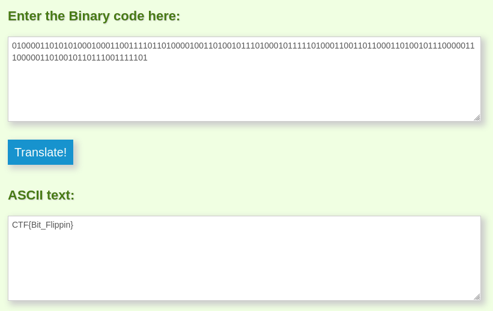

## Reverse Polarity
The main idea finding the flag is Binary to ASCII conversion.

#### Step-1:
After seeing the text, we get the following:
`I got a new hard drive just to hold my flag, but I'm afraid that it rotted. What do I do? The only thing I could get off of it was this: `

```
01000011010101000100011001111011010000100110100101110100010111110100011001101100011010010111000001110000011010010110111001111101
```

I tried to convert the given Binary text to ASCII.

#### Step-2:
I followed the URL:  https://www.convertbinary.com/to-text/

I got the following result:



Voila, we have it.
#### Step-3:

Finally the flag becomes:
`CTF{Bit_Flippin}`
