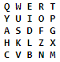
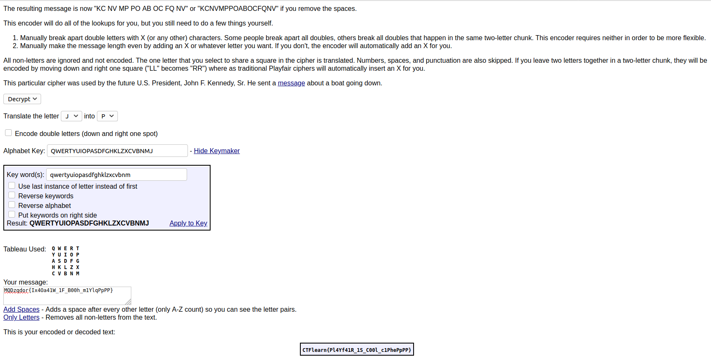

## Suspecious message
The main idea to find the flag is to use PlayFair Cipher.

#### Step-1:
We are given `photo.png` and a message `MQDzqdor{Ix4Oa41W_1F_B00h_m1YlqPpPP}`. We know that the flag format has to be CTFlearn{} and so, I got idea from the `photo.png`.

#### Step-2:
Immediately, I tried for Playfair Cipher at:
http://rumkin.com/tools/cipher/playfair.php

#### Step-3:
I used the given parameters and got the flag.

The flag at the end, seemed bit obfuscated. So, I replaced all the P with R.
#### Step-4:
Finally, the flag becomes:
`CTFlearn{Pl4Yf41R_1S_C00l_c1PheRrRR}`