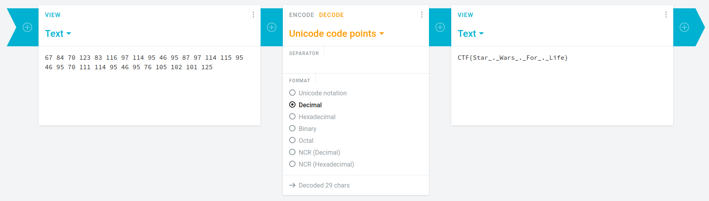

## Symbolic Decimals
The main idea finding the flag is simple Cryptographic knowledge.

#### Step-1:
After I read the given message:

```
Did you know that you can hide messages with symbols? For example, 
!@#$%^&*( is 123456789!
Now Try: ^&,*$,&),!@#,*#,!!^,(&,!!$,(%,$^,(%,*&,(&,!!$,!!%,(%,$^,(%,&),!!!,!!$,(%,$^,(%,&^,!)%,!)@,!)!,!@% 
However, this isn't as easy as you might think.
```

#### Step-2:
If we see carefully, the assignment of `!@#$%^&*(` = `123456789` is same as QWERTY Keyboard symbols.
So it means `)` = `0`.

So finally `!@#$%^&*()` = `1234567890`

#### Step-3:
I just decrypted the text as normal decimal text.

```python
message = "^&,*$,&),!@#,*#,!!^,(&,!!$,(%,$^,(%,*&,(&,!!$,!!%,(%,$^,(%,&),!!!,!!$,(%,$^,(%,&^,!)%,!)@,!)!,!@%"
numbers = "67,84,70,123,83,116,97,114,95,46,95,87,97,114,115,95,46,95,70,111,114,95,46,95,76,105,102,101,125"
```
If you want the string of numbers as spaced. It's here:
`67 84 70 123 83 116 97 114 95 46 95 87 97 114 115 95 46 95 70 111 114 95 46 95 76 105 102 101 125`

#### Step-4:
We just need to decrypt it online. I did it [here](https://cryptii.com/pipes/decimal-text).



#### Step-5:
Finally the flag becomes: 
`CTF{Star_._Wars_._For_._Life}`