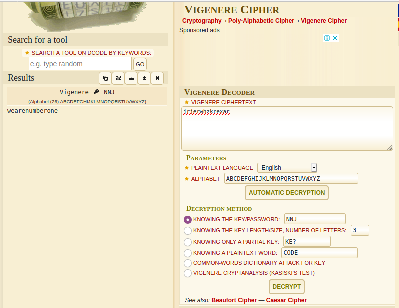

## The Simpsons
The main idea finding the flag is finding the key through layers of encryption.

#### Step-1:
After I downloaded `ItsKrumpingTime.jpg`, I tried basic `strings ItsKrumpingTime.jpg` on it.


#### Step-2:
I got this output:

```
...
Ahh! Realistically the Simpsons would use octal instead of decimal!
encoded = 152 162 152 145 162 167 150 172 153 162 145 170 141 162
key = chr(SolutionToDis(110 157 167 040 155 165 143 150 040 144 151 144 040 115 141 147 147 151 145 040 157 162 151 147 151 156 141 154 154 171 040 143 157 163 164 077 040 050 104 151 166 151 144 145 144 040 142 171 040 070 054 040 164 157 040 164 150 145 040 156 145 141 162 145 163 164 040 151 156 164 145 147 145 162 054 040 141 156 144 040 164 150 145 156 040 160 154 165 163 040 146 157 165 162 051))
key = key + key + chr(ord(key)-4)
print(DecodeDat(key=key,text=encoded))
```

#### Step-3:
So, this is what I had understood by the description.

- We have an encoded message, in the encoded variable.  
- We have a key, in the key variable.  
- We have a print of a final result which is the message, decrypted with the key.
  
These numbers, is most likely Base8, as mentioned in description.

#### Step-4:
Converting all the numbers from base8 to decimal and then to ASCII by `encoding.py`

```python
encoded = "152 162 152 145 162 167 150 172 153 162 145 170 141 162"
list_encoded = encoded.split(' ')
decimal_encoded = [int(i, 8) for i in list_encoded] #Decimal Conversion
string_encoded = [chr(i) for i in decimal_encoded] #ASCII Conversion
string_encoded  = ''.join(string_encoded)
print("String Encoded: " + string_encoded)
```

By running this as `python3 encoding.py`, we get this output:

```bash
String Encoded: jrjerwhzkrexar
```

#### Step-5:

This `key.py` helps us to find the key. 

```python
key = "110 157 167 040 155 165 143 150 040 144 151 144 040 115 141 147 147 151 145 040 157 162 151 147 151 156 141 154 154 171 040 143 157 163 164 077 040 050 104 151 166 151 144 145 144 040 142 171 040 070 054 040 164 157 040 164 150 145 040 156 145 141 162 145 163 164 040 151 156 164 145 147 145 162 054 040 141 156 144 040 164 150 145 156 040 160 154 165 163 040 146 157 165 162 051"
list_key = key.split(' ')
decimal_key = [int(i, 8) for i in list_key]
asc_key = [chr(i) for i in decimal_key]
asc_key = ''.join(asc_key)
print(asc_key)
```
I thought I just needed to execute this script to get the key. But alas, this gave me this output:

Output:
```bash
How much did Maggie originally cost? (Divided by 8, to the nearest integer, and then plus four)
```


#### Step-6:
We just need to find the key. So I found this on Internet about [Simpsons and supermarket stuff](https://quizzclub.com/trivia/how-much-does-maggie-simpson-cost-in-the-opening-titles-when-she-is-scanned-at-checkout/answer/65502/).

 So I did the Math here like a noobie: (According to what was said above in output.)
```
($847.63 / 8) = $105.95 ≈ $106

Next, $106 + $4 = $110.
```
ASCII value of 110 is `n`. So finally the key is `n`.

#### Step-7:
Given this:

`key = key + key + chr(ord(key)-4)` as before in `strings` output.

I did this to get the final key.

```
>>> key = 'n'
>>> key = key + key + chr(ord(key)-4)
>>> key
'nnj'
```
#### Step-8:
Now it was simple [Vigenere Cipher](https://en.wikipedia.org/wiki/Vigen%C3%A8re_cipher) which I decoded [here](https://www.dcode.fr/vigenere-cipher).



#### Step-9:
Finally the flag becomes: 
`wearenumberone`