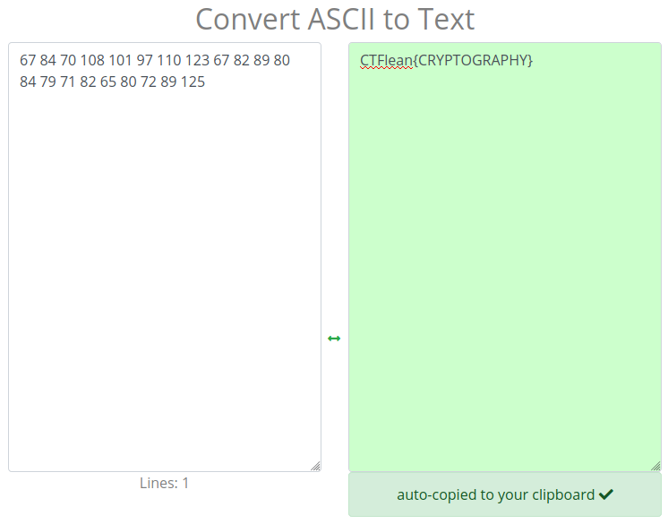

## Tone dialing
The main idea to find the flag is to analyze `.wav` file and get the flag using DTMF Decoder.

#### Step-1:
We are given `you_know_what_to_do.wav`. After searching for a while on internet, I came across this [DTMF Decoder](http://www.polar-electric.com/DTMF/Index.html) which eventually helped me to solve problem.

#### Step-2:
This [DTMF GitHub Repo](https://github.com/ribt/dtmf-decoder) is a nice tool, which can help us to extract data from wav file.

After, following the directions mentioned in the repository, I executed the following command:
```
dtmf you_know_what_to_do.wav
```
I got this following output:
```
67847010810197110123678289808479718265807289125
```
So, general delimiting the numbers gave me:
```
67 84 70 108 101 97 110 123 67 82 89 80 84 79 71 82 65 80 72 89 125
``` 

#### Step-3:
I used these numbers to get ASCII text [here](https://convert.town/ascii-to-text). Later we got the flag.



#### Step-4:
Finally, the flag becomes:
`CTFlean{CRYPTOGRAPHY}`