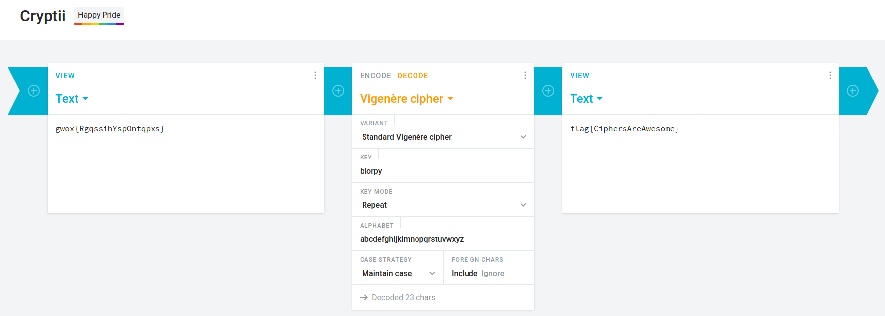

## Vigenere Cipher
The main idea finding the flag is just having knowledge about Vigenere Cipher.

#### Step-1:

Its very easy if you have basic idea of Vigenere Cipher. If you don't know, please refer : 
https://en.wikipedia.org/wiki/Vigen%C3%A8re_cipher

So this is what is given in the message of challenge:

```
The vignere cipher is a method of encrypting alphabetic text by using a series of interwoven Caesar ciphers based on the letters of a keyword.<br />

I’m not sure what this means, but it was left lying around: blorpy

gwox{RgqssihYspOntqpxs}
```
#### Step-2:
One thing is important to know that Vigenere Cipher requires a <strong>key</strong> to decode any message. 
I used this URL to decode my message and used given key as : `blorpy`
https://cryptii.com/

#### Step-3:
This was my output:



That's it. That's our flag.

#### Step-4:

Finally the flag becomes:
`flag{CiphersAreAwesome}`