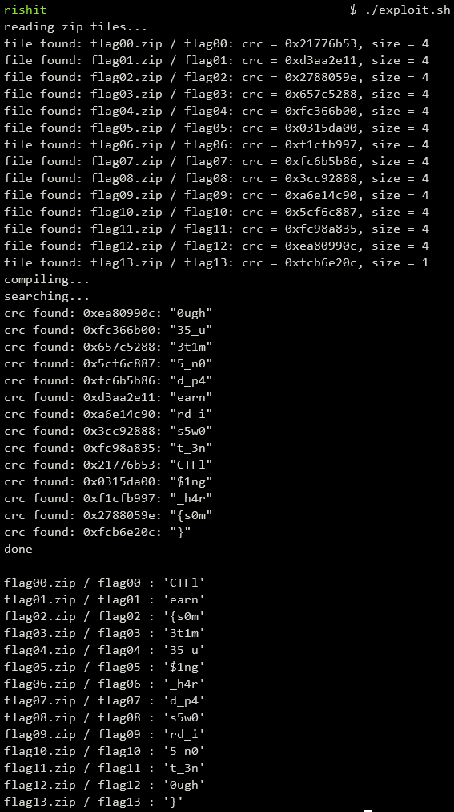
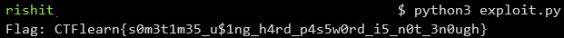

## Zippy.zip
The main idea finding the flag is analyzing the Cyclic Redundancy Checks of the zips.

#### Step-1:
After we download `flag_parts.zip` from the cloud, we see there are 14 files namely `flag00.zip`, `flag01.zip`, ... , `flag13.zip`. We then extract all the zips into a directory called `flag_parts/`.

#### Step-2:
I did not get any idea at first using basic recon on the zip file provided, so when I searched online, I found this [article](https://medium.com/@neilharveycodex13/how-do-we-solve-the-zippy-zip-in-ctflearn-860b2eb75541) which gives a hint to the [zip-crc-cracker](https://github.com/kmyk/zip-crc-cracker) tool.

#### Step-3:
In order to execute the zip-crc cracker tool, we can write a small bash script `exploit.sh` which is as follows:

```bash
cd flag_parts/
python3 ../crack.py flag00.zip flag01.zip flag02.zip flag03.zip flag04.zip flag05.zip flag06.zip flag07.zip flag08.zip flag09.zip flag10.zip flag11.zip flag12.zip flag13.zip
```
After executing the above script using the command `./exploit.sh`, we get the following output:



#### Step-4:
After we see some parts of flags from there, we just use a small formatting script `exploit.py` to print out the final flag which is as follows:

```python
# Assigning the output string from the previous "crack.py" file execution
output = """
flag00.zip / flag00 : 'CTFl'
flag01.zip / flag01 : 'earn'
flag02.zip / flag02 : '{s0m'
flag03.zip / flag03 : '3t1m'
flag04.zip / flag04 : '35_u'
flag05.zip / flag05 : '$1ng'
flag06.zip / flag06 : '_h4r'
flag07.zip / flag07 : 'd_p4'
flag08.zip / flag08 : 's5w0'
flag09.zip / flag09 : 'rd_i'
flag10.zip / flag10 : '5_n0'
flag11.zip / flag11 : 't_3n'
flag12.zip / flag12 : '0ugh'
flag13.zip / flag13 : '}'
"""

# Split the output into lines and extract the last column
lines = output.strip().split('\n')
last_column = [line.split(' : ')[1].strip(" '") for line in lines]

# Concatenate the strings within quotes
flag = ''.join(last_column)

# Print the final flag
print("Flag: " + flag)
```
#### Step-5:
We then execute the script using the command: `python3 exploit.py`



#### Step-6:
Finally the flag becomes:
`CTFlearn{s0m3t1m35_u$1ng_h4rd_p4s5w0rd_i5_n0t_3n0ugh}`