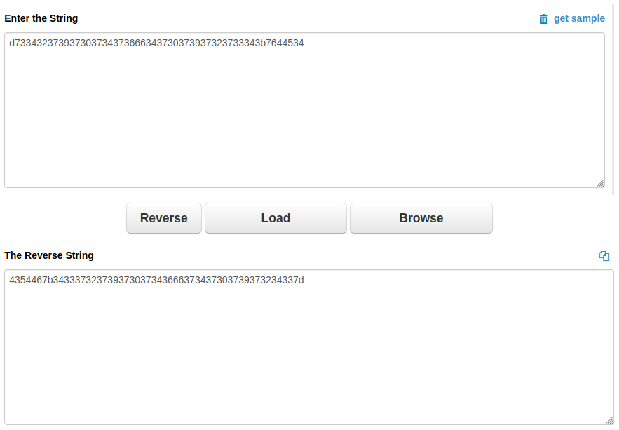
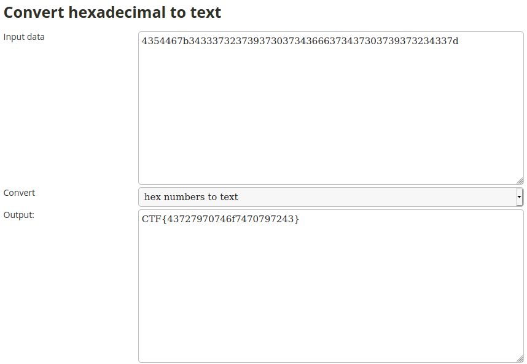
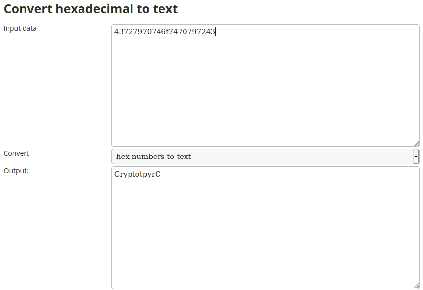

## otpyrC
The main idea of finding the flag is String Reversal and simple decryption.


#### Step-1:
After I read the given message:

```
Okay, this one is pretty easy... but not necessarily.
d733432373937303734373666343730373937323733343b7644534
```

#### Step-2:
I was lazy af to write a script in python. So, I just did the Reversal Online at: (reverse because after seeing title)
https://codebeautify.org/reverse-string



#### Step-3:

It was just hexadecimal text and I decrypted it.



I got `CTF{43727970746f7470797243}`, but did not work as flag.

So decrypted the string again.



#### Step-4:
Finally, the flag becomes: 
`CryptotpyrC`