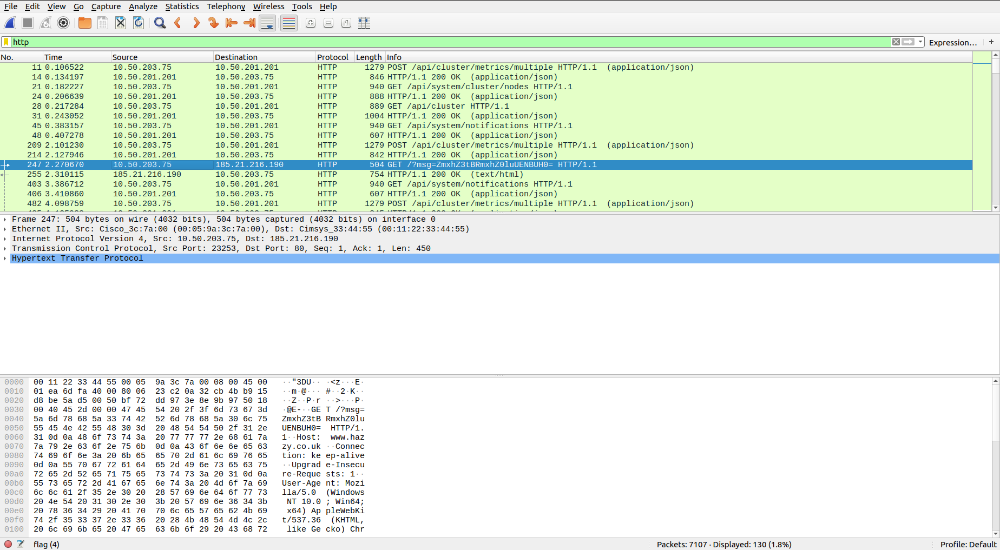
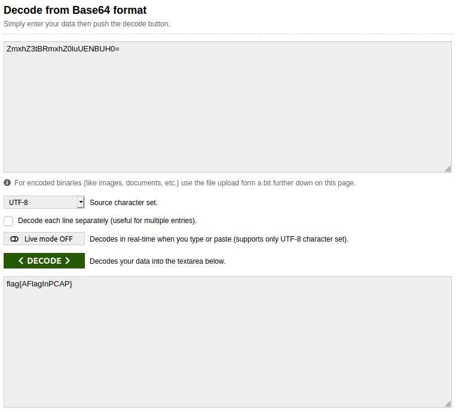

## A CAPture of a Flag
The main idea finding the flag is exploring the given PCAP file in Wireshark.

#### Step-1:
After downloading `flag (4)` (a PCAP file) from the cloud, I directly opened it in Wireshark application.

For those, who are unaware om how to filter streams or use this application, please do your homework here:

https://www.wireshark.org/

#### Step-2:

I tried to check TCP stream for some clues and then I tried UDP streams for some clues. Finally, I used the filter to get only HTTP requests.

#### Step-3:

I went through all requests and this request caught my eye. 
`247	2.270670	10.50.203.75	185.21.216.190	HTTP	504	GET /?msg=ZmxhZ3tBRmxhZ0luUENBUH0= HTTP/1.1 `

It has a Base64 encrypted message.

#### Step-4:

So finally, I decoded it online at: https://www.base64decode.org/

I got the flag there:

Voila, we have it here.

#### Step-4:
Finally the flag becomes:
`flag{AFlagInPCAP}`