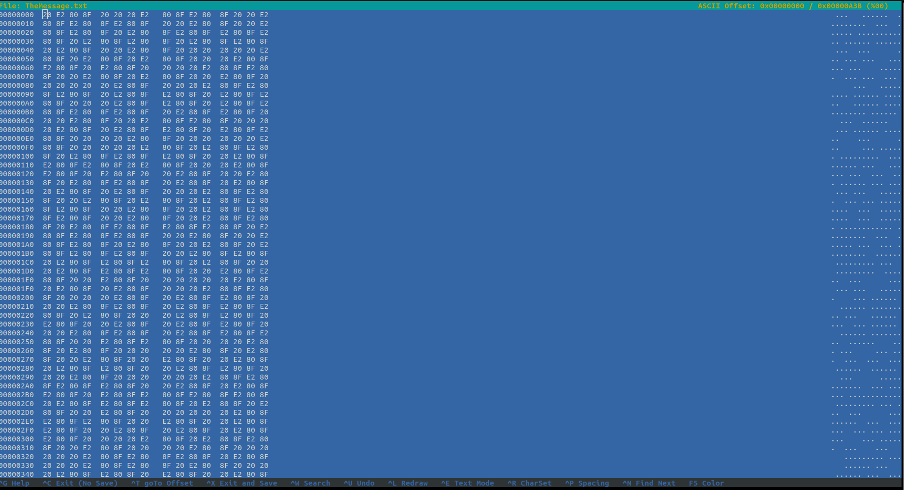
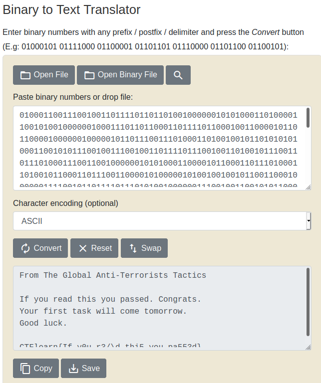

## Blank Page
The main idea to find the flag is to open file using Python.

#### Step-1:
We are given `TheMessage.txt`. When I tried a simple `cat TheMessage.txt`, it gave me a blank space. but actually opening the file in Hex Editor gave me idea on how to approach.



#### Step-2:
Now, we saw all, `.` and spaces, so I replaced them with `1` and `0`. I wrote `exploit.py` to get the result:

```py
#! usr/bin/python3
file = open("TheMessage.txt", "r").read()
result = ""
for char in file:
	if ord(char) == 32:
		result += "0"
	else:
		result += "1"
print(result)
```

#### Step-3:
When I ran this script as `python3 exploit.py`, I got the following output:

```bash
01000110011100100110111101101101001000000101010001101000011001010010000001000111011011000110111101100010011000010110110000100000010000010110111001110100011010010010110101010100011001010111001001110010011011110111001001101001011100110111010001110011001000000101010001100001011000110111010001101001011000110111001100001010000010100100100101100110001000000111100101101111011101010010000001110010011001010110000101100100001000000111010001101000011010010111001100100000011110010110111101110101001000000111000001100001011100110111001101100101011001000010111000100000010000110110111101101110011001110111001001100001011101000111001100101110000010100101100101101111011101010111001000100000011001100110100101110010011100110111010000100000011101000110000101110011011010110010000001110111011010010110110001101100001000000110001101101111011011010110010100100000011101000110111101101101011011110111001001110010011011110111011100101110000010100100011101101111011011110110010000100000011011000111010101100011011010110010111000001010000010100100001101010100010001100110110001100101011000010111001001101110011110110100100101100110010111110111100100110000011101010101111101110010001100110010111101011100011001000101111101110100011010000110100100110101010111110111100101101111011101010101111101110000011000010011010100110101001100110110010001111101
```

#### Step-4:
Then simply converting the Binary to ASCII text [here](https://www.rapidtables.com/convert/number/binary-to-ascii.html), gave me the flag.

```bash
From The Global Anti-Terrorists Tactics

If you read this you passed. Congrats.
Your first task will come tomorrow.
Good luck.

CTFlearn{If_y0u_r3/\d_thi5_you_pa553d}
```



#### Step-5:
Finally, the flag becomes:
`CTFlearn{If_y0u_r3/\d_thi5_you_pa553d}`