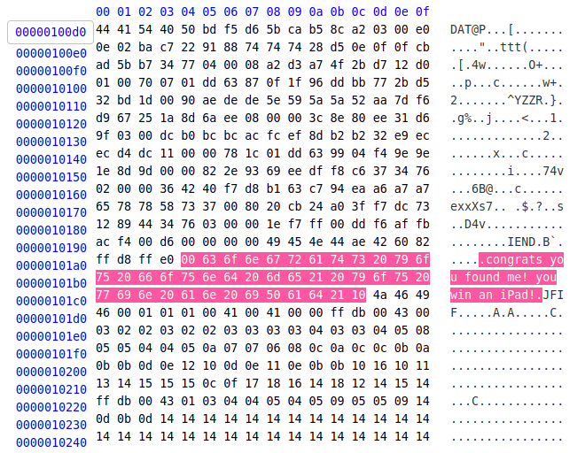
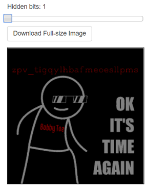
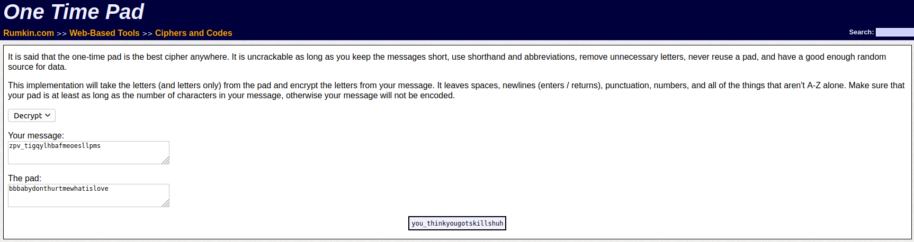

## Bobby Toe's iPad
The main idea of getting the flag is using hex dump to get the flag.

#### Step-1:
After I downloaded `bobbytoesipad.png`, I tried basic strings, binwalk, but nothing special.

#### Step-2:
So, now I checked the hex code at: https://www.onlinehexeditor.com/

I split the image where I found the message: `congrats you found me! you win an iPad!`

##### Note: `ff d8 ff e0` are the first hex of a JPEG file.

After splitting, I got this:

#### Step-3:
I used an [Online Stego Tool](https://incoherency.co.uk/image-steganography/#unhide) to find hidden message in the image:

I got this:

Also, I got this weird string in the image: `zpv_tigqylhbafmeoesllpms`

#### Step-4:
The description of the challenge hints that the flag is in the iPad, so after some search, I got this: http://rumkin.com/tools/cipher/otp.php to decode one-time pad message.

Note that we got `bbbabydonthurtmewhatislove` string in split image before! That's the padding here.

#### Step-5:
Finally, the flag becomes:
`you_thinkyougotskillshuh`