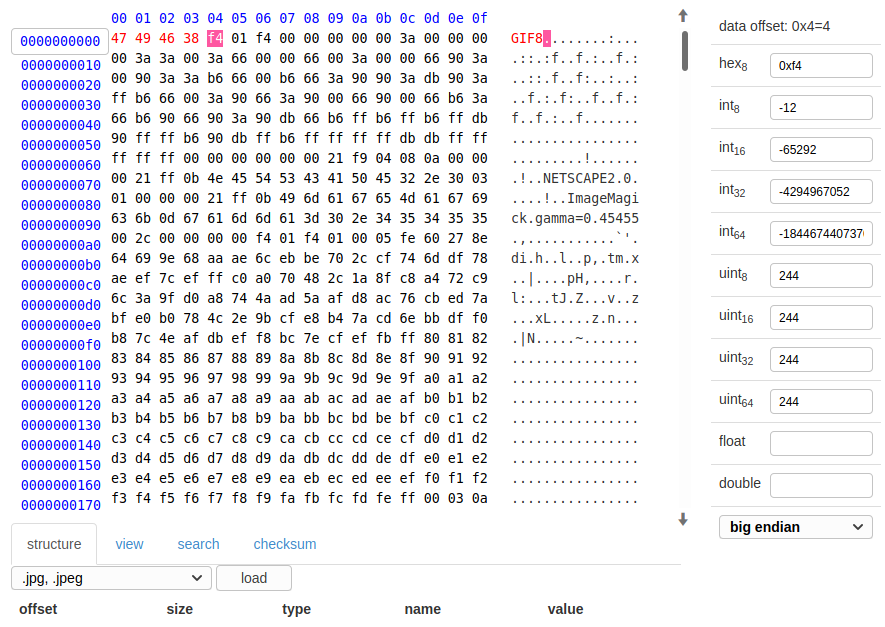
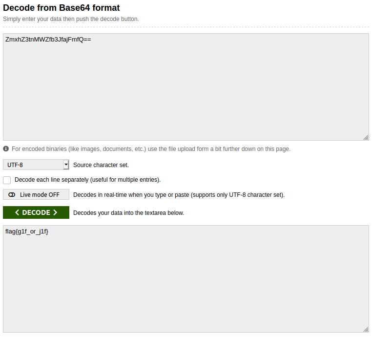

## Corrupted File
The main idea finding the flag is get flag using manipulation in the header of GIF.

#### Step-1:
After I downloaded `unopenable.gif`, it is not accessible. When I checked online its hex dump, it differed from standard GIF header.

#### Step-2:
A standard GIF header should look like a Hex-Dump mentioned here: 
https://www.file-recovery.com/gif-signature-format.htm

So, I edited the header accordingly:

#### Step-3:
After downloading the new `New.gif`, if we see the gif. It runs very fast.

But we can see a Base64 encrypted text `ZmxhZ3tnMWZfb3JfajFmfQ==` 

I decoded it online at: https://www.base64decode.org/

#### Step-4:
Finally the flag becomes: 
`flag{g1f_or_j1f}`
