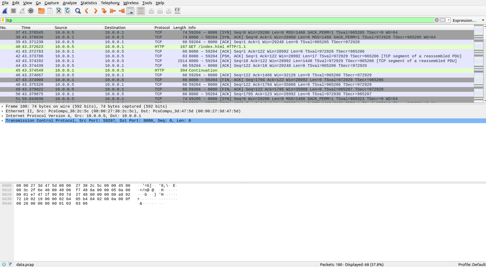
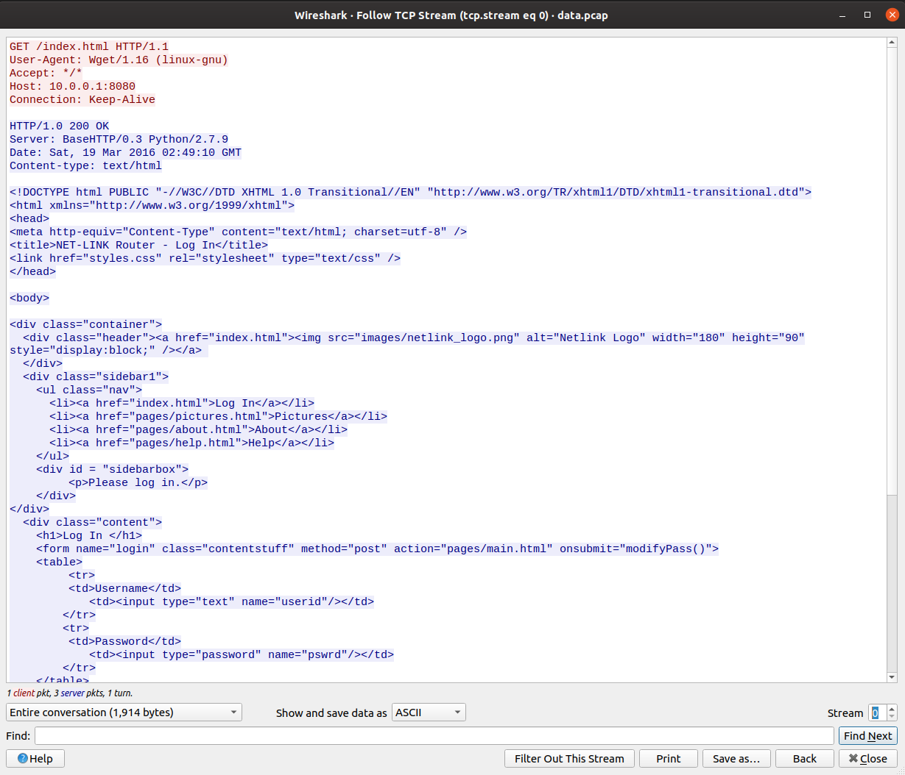
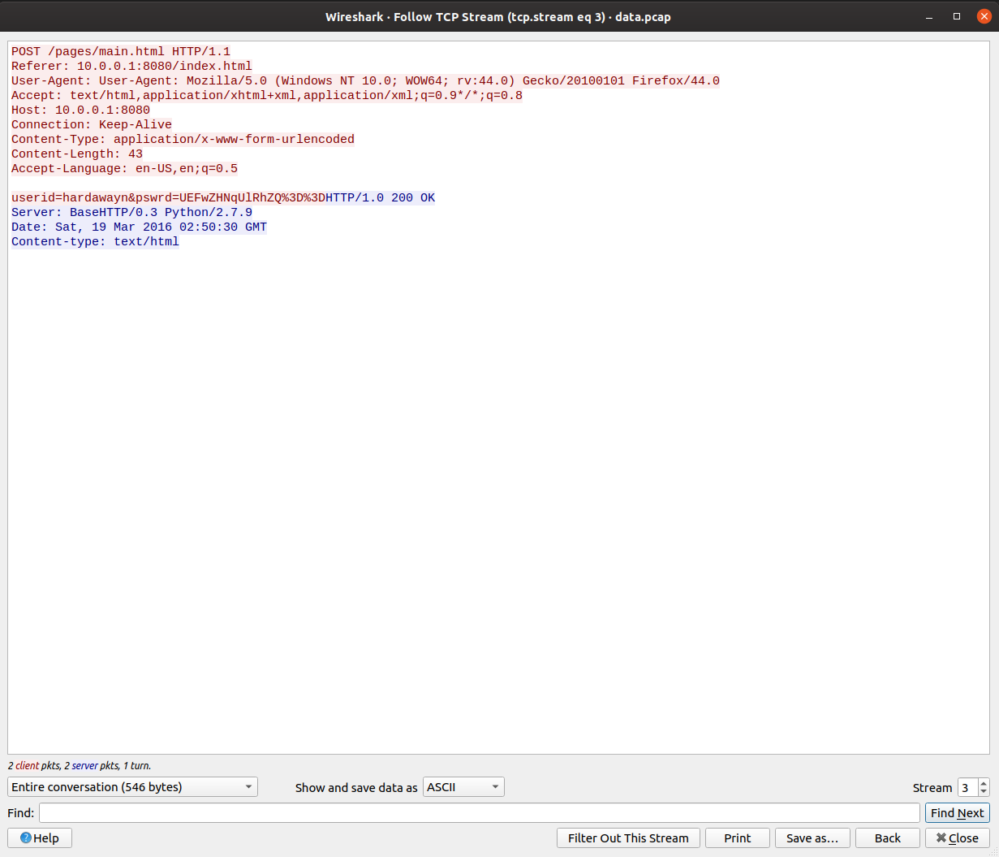
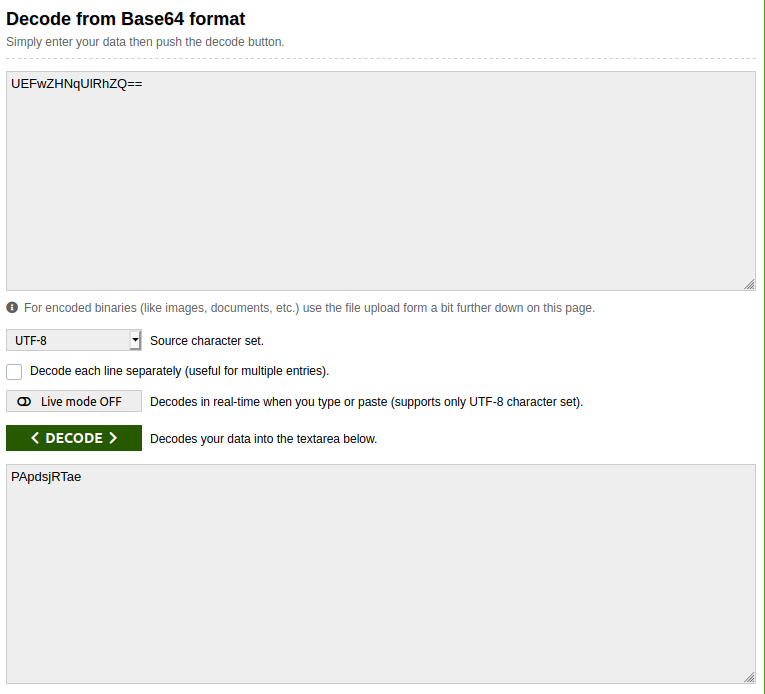

## Digital Camouflage
The main idea finding the flag is Network Interception and some Crytographic Techniques.

#### Step-1:
After downloading `data.pcap` from the cloud, I directly opened it in Wireshark.

For those, who are unaware of how to use this tool for Network Interception, can refer here:
https://www.wireshark.org/

I tried to check the Hex Dump, but couldn't find something special.

#### Step-2:
So, I tried to check the TCP stream in different frames. For those, who are unaware on how to do this:

- Open `data.pcap` in Wireshark.
- In the filters, put on TCP and then Enter to get all the TCP traffic of the network.

- I wanted to check each and every frame as question is somewhat hinting in that direction, so to check that, Analyse -> Follow -> TCP Stream

- We can alter streams by changing the counter in bottom right corner.
- As I reached 3rd stream, I observed some credentials there.

`userid=hardawayn&pswrd=UEFwZHNqUlRhZQ%3D%3D`
#### Step-3:
So, it is clear that password is Base64 encrypted and in web URLs, %3D is to be replaced by =.

So I tried to decode the Base64 encryption online at: https://www.base64decode.org/

It had the flag in it. Voila.

#### Step-4:
Finally the flag becomes:
`PApdsjRTae`