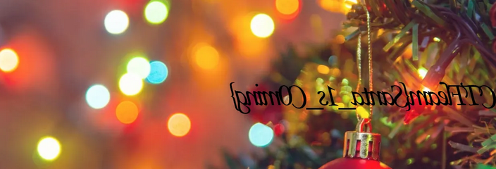

## Exclusive Santa
The main idea finding the flag is using binwalk and Stegsolve.

#### Step-1:
After I downloaded `Exclusive_Santa.rar`, we have `1.png` & `3.png` in it.

When I tried `binwalk 3.png`, I got other `zip` files in it.

#### Step-2:
So, when we extract those and then use Stegsolve with Image Combiner (basically XOR), we get the flag.

#### Step-3:
Finally the flag becomes: 
`CTFlearn{Santa_1s_C0ming}`