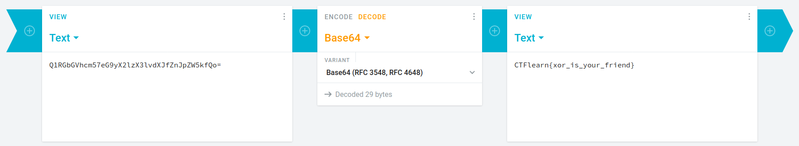
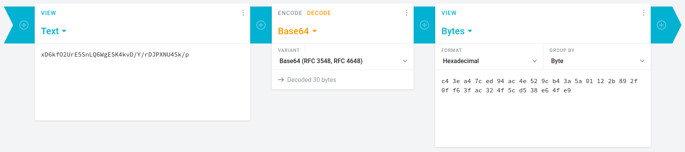
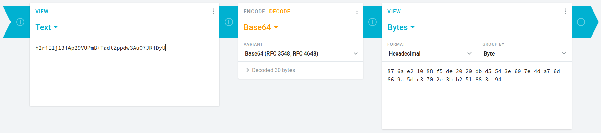
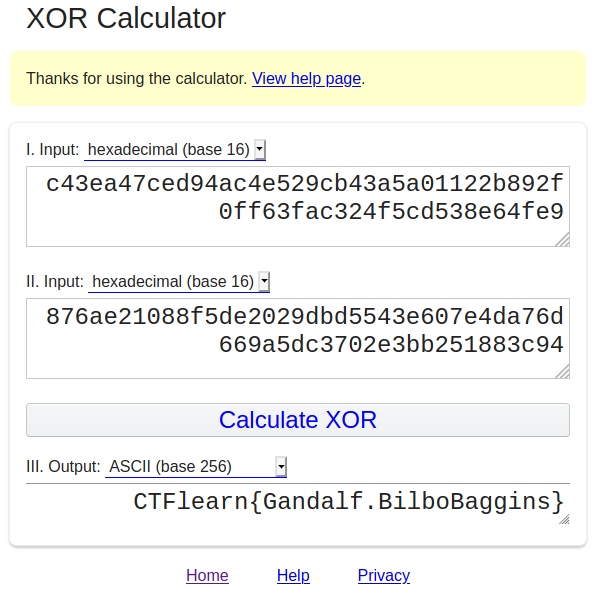

## GandalfTheWise
The main idea finding the flag is XOR strings.
#### Step-1:
After downloading `Gandalf.jpg`, I tried `strings Gandalf.jpg` and got this output. These are initial strings embedded in Meta data of image. 

```
JFIF
+Q1RGbGVhcm57eG9yX2lzX3lvdXJfZnJpZW5kfQo=
+xD6kfO2UrE5SnLQ6WgESK4kvD/Y/rDJPXNU45k/p
+h2riEIj13iAp29VUPmB+TadtZppdw3AuO7JRiDyU
...
```

#### Step-2:
I decrypted the 1<sup>st</sup> Base64 encrypted string i.e. `Q1RGbGVhcm57eG9yX2lzX3lvdXJfZnJpZW5kfQo=` at https://cryptii.com/.



It gives a false flag `CTFlearn{xor_is_your_friend}`, but on a brighter side it gives idea of XOR'ing the next 2 strings.

#### Step-3:
So, I decrypted remaining 2 strings to get hexadecimal texts because in that [RFC](https://datatracker.ietf.org/doc/html/rfc5987), ASCII text isn't possible.






#### Step-4:
I XOR them online at: http://xor.pw/ to get the flag.



#### Step-5:
Finally the flag becomes:


[comment]: <> (`CTFlearn{Gandalf.BilboBaggins}`)
