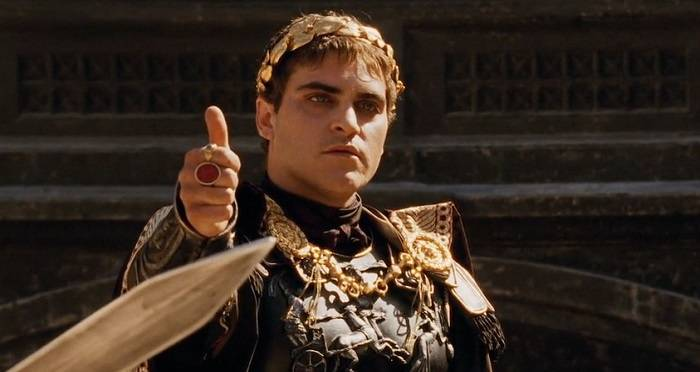
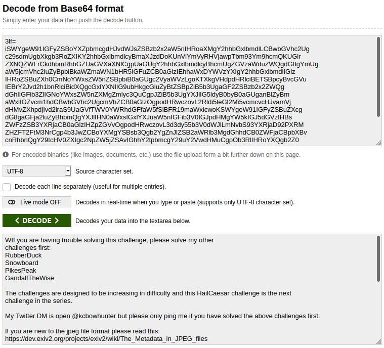
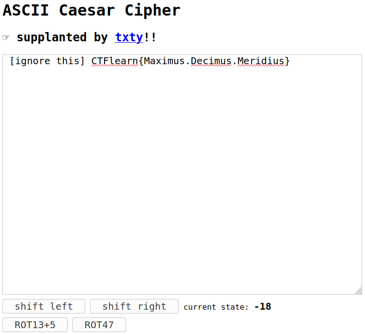

## HailCaesar!
The main idea of finding the flag is Ceaser Cipher and bruteforcing with shifts.

#### Step-1:
After I downloaded `HailCaesar.jpg`, I tried some basic stego stuff on image.



#### Step-2:
When I tried `file HailCaesar.jpg`, it gave me this message:

```
HailCaesar.jpg: JPEG image data, JFIF standard 1.01, resolution (DPI), density 72x72,
segment length 16, comment: "CTFlearn{Hail_Caesar!!!}", comment: "/<V5;)j}j6\
<Y)8><\9Fbu,Hy4ONC}pxP"4st12wn`?@O$6BgQo7i#gtD|s>3lf=", comment: "SWYgeW91IGFyZSBoYXZpbmcgdHJvdWJsZSBzb2x2aW5nIHRoaXMgY2hhbGxlbmdlLCBwbGVhc2Ug", comment:
"2m{y!"%w2'z{&o2UfX~ws%!._s+{ (&@Vwu{ (&@_w%{v{(&0", progressive, precision 8, 700x372, 
components 3
```
Nice! I got some some comments to work on.

#### Step-3:
Next I tried `strings HailCaesar.jpg` and I got this:

```
JFIF
CTFlearn{Hail_Caesar!!!}
CTFlearn{Airplanes_Sometimes_Cause_Inflight_Incidents}
CTFlearn{Flight_32_Leaves_soon_from_gate_126}
B/<V5;)j}j6\<Y)8><\9Fbu,Hy4ONC}pxP"4st12wn`?@O$6BgQo7i#gtD|s>3lf=
iSWYgeW91IGFyZSBoYXZpbmcgdHJvdWJsZSBzb2x2aW5nIHRoaXMgY2hhbGxlbmdlLCBwbGVhc2Ug
c29sdmUgbXkgb3RoZXIKY2hhbGxlbmdlcyBmaXJzdDoKUnViYmVyRHVjawpTbm93Ym9hcmQKUGlr
ZXNQZWFrCkdhbmRhbGZUaGVXaXNlCgpUaGUgY2hhbGxlbmdlcyBhcmUgZGVzaWduZWQgdG8gYmUg
aW5jcmVhc2luZyBpbiBkaWZmaWN1bHR5IGFuZCB0aGlzIEhhaWxDYWVzYXIgY2hhbGxlbmdlIGlz
IHRoZSBuZXh0CmNoYWxsZW5nZSBpbiB0aGUgc2VyaWVzLgoKTXkgVHdpdHRlciBETSBpcyBvcGVu
IEBrY2Jvd2h1bnRlciBidXQgcGxlYXNlIG9ubHkgcGluZyBtZSBpZiB5b3UgaGF2ZSBzb2x2ZWQg
dGhlIGFib3ZlIGNoYWxsZW5nZXMgZmlyc3QuCgpJZiB5b3UgYXJlIG5ldyB0byB0aGUganBlZyBm
aWxlIGZvcm1hdCBwbGVhc2UgcmVhZCB0aGlzOgpodHRwczovL2Rldi5leGl2Mi5vcmcvcHJvamVj
dHMvZXhpdjIvd2lraS9UaGVfTWV0YWRhdGFfaW5fSlBFR19maWxlcwoKSWYgeW91IGFyZSBuZXcg
dG8gaGFja2luZyBhbmQgYXJlIHN0aWxsIGxlYXJuaW5nIGFib3V0IGJpdHMgYW5kIGJ5dGVzIHBs
ZWFzZSB3YXRjaCB0aGlzIHZpZGVvOgpodHRwczovL3d3dy55b3V0dWJlLmNvbS93YXRjaD92PXRM
ZHZFT2FtM3NrCgp4b3JwZCBoYXMgYSBsb3Qgb2YgZnJlZSB2aWRlb3MgdGhhdCB0ZWFjaCBpbXBv
cnRhbnQgY29tcHV0ZXIgc2NpZW5jZSAvIGhhY2tpbmcgY29uY2VwdHMuCgpOb3RlIHRoYXQgb2Z0
ZW4gbXkgY2hhbGxlbmdlcyBjb21iaW5lIGZvcmVuc2ljcyBhbmQgc29tZSBhc3BlY3Qgb2YgY3J5
cHRvZ3JhcGh5LgoKSGF2ZSBmdW4hCmtjYm93aHVudGVyCgoK
42m{y!"%w2'z{&o2UfX~ws%!._s+{ (&@Vwu{ (&@_w%{v{(&0
```
All those flags above are false, but they give us Hints. 
- CTFlearn{Hail_Caesar!!!} - It gives us idea that it involves Ceaser Cipher (Also the title of challenge)
- CTFlearn{Airplanes_Sometimes_Cause_Inflight_Incidents} - ASCII (Initials of flag)
- CTFlearn{Flight_32_Leaves_soon_from_gate_126} - Still unclear for me. (But something with ASCII 32-126)

#### Step-4:
It is to be noted that `2m{y!"%w2'z{&o2UfX~ws%!._s+{ (&@Vwu{ (&@_w%{v{(&0` is the common string between the `strings HailCeaser.jpg` & `file HailCeaser.jpg` result.

Let's try to decode the Base64 string given above.



Result:
```
WIf you are having trouble solving this challenge, please solve my other
challenges first:
RubberDuck
Snowboard
PikesPeak
GandalfTheWise

The challenges are designed to be increasing in difficulty and this HailCaesar challenge is the next
challenge in the series.

My Twitter DM is open @kcbowhunter but please only ping me if you have solved the above challenges first.

If you are new to the jpeg file format please read this:
https://dev.exiv2.org/projects/exiv2/wiki/The_Metadata_in_JPEG_files

If you are new to hacking and are still learning about bits and bytes please watch this video:
https://www.youtube.com/watch?v=tLdvEOam3sk

xorpd has a lot of free videos that teach important computer science / hacking concepts.

Note that often my challenges combine forensics and some aspect of cryptography.

Have fun!
kcbowhunter
```

#### Step-5:
Nothing interesting. So I lead to decrypting the message from ASCII Ceaser Cipher. I did it [here](https://sltls.org/shift).



#### Step-6:
Finally, the flag becomes: 

[comment]: <> (`CTFlearn{Maximus.Decimus.Meridius}`)

