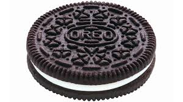

## Milk's Best Friend
The main idea finding the flag is to find the hidden files and apply basic forensics techniques.

#### Step-1:
After we download `oreo.jpg` from the cloud, I tried `strings oreo.jpg`, there I couldn't find the correct flag. So I tried for some hidden data in the image.



#### Step-2:
I tried out `binwalk oreo.jpg` and got the following output:

```
DECIMAL       HEXADECIMAL     DESCRIPTION
--------------------------------------------------------------------------------
0             0x0             JPEG image data, JFIF standard 1.01
9515          0x252B          RAR archive data, version 4.x, first volume type: MAIN_HEAD
```

This clears that we have a RAR file inside the image. 

#### Step-3:
To extract all, I used `binwalk -D oreo.jpg` and I got a directory `_oreo.jpg.extracted` at that location.

I checked its contents and it had a directory called `1` & a zip file `252B.rar`. I chose to explore `1` first.

#### Step-4:
In `1`, I got a file `a` & `b.jpg`. So my next instinct was to try out `strings b.jpg` and Voila it worked.


I got the following output:

```
JFIF
"1$%)+...
383-7(-.+
%----------------------+----------------------+---7
!1AQqa
\5n`]
xsLy
.y fk
vSk:M
DzuMb
_NZ@
]ETyn
Xg3H
nBC_
]95r
C^^[p
Q`';
q`7'
\\o*
. 	&
04KZ
)Qc&
Q{k~
st&[
NW89
Lk$[
1Y79
a0\A
$;6g
%mG+$
DysM
2em7
6M>f
Ztn`$F
qUhTmjN
+67*
e6hi 
0d$j
-ko)'
CH;^u
&Du=
$t$Lv
1/i 
/1-6n
Gx#GA
M8n!
iT0?
kVI8
`.}v
gPl,c
bsDKw
O]=6V1
Rx|!
\l&>
!G=*
HSayi-9
#X3i
c>R2
 $+cmk1
u|h]a
tEp#
&Z	2`
ZMmG
a;}V
{2sRpo7%V
0=Q-C:
[e[!A
|5xk
+NgU
;HO+dD
D272}
`h	:
K`8m:-
Finally, flag{eat_more_oreos}
```

#### Step-5:
Finally the flag becomes:
`flag{eat_more_oreos}`