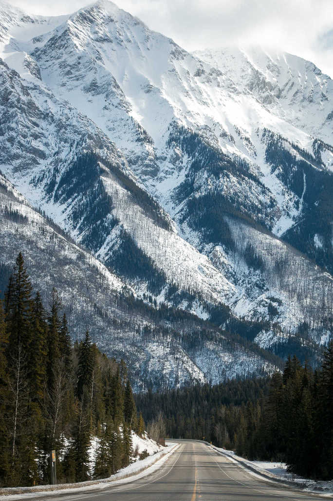
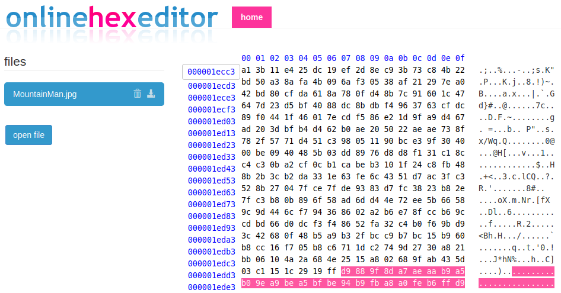
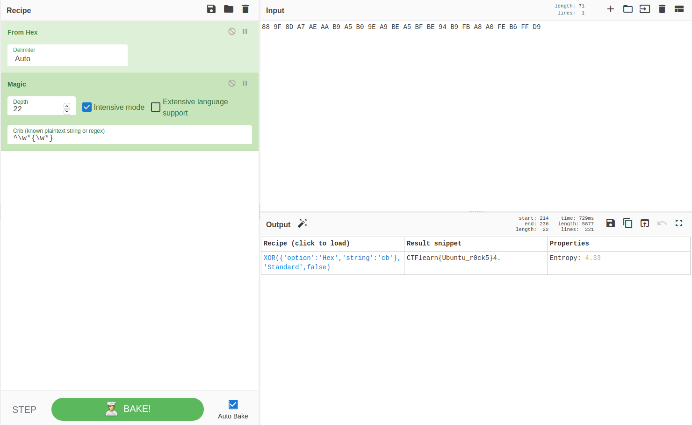

## MountainMan
The main idea of finding the flag is intense Forensics Skills.

#### Step-1:
After I downloaded `MountainMan.jpg`, I checked for basic commands like `strings`, `binwalk`, etc. But no luck.

#### Step-2:
For this challenge, I checked only `0xffd9` marker in the whole JPEG file structure. This marker is mentioned in the challenge description, so it is probably a lead to the solution.

After some searching I got hold of: http://vip.sugovica.hu/Sardi/kepnezo/JPEG%20File%20Layout%20and%20Format.htm

#### Step-3:
Generally, there is only 1 `0xffd9` marker which represents the `EOI (End of Image)`, but this had 2. I checked it at [Online Hex Editor](https://www.onlinehexeditor.com/).

#### Step-4:
This seemed difficult at first attempt. But after few days, I got this idea. In the description of challenge `xor is our friend` is mentioned. So, I tried to checkout methods of [Bruteforce for XOR keys](https://writeups.noxtal.com/#/posts/2020-05-21-ctflearn227). Please go through it if you don't know how to do it using Cyber Chef Magic Inputs. It can be done by Decode fr also.

I did exactly that and got the flag. My inputs were like [this](https://gchq.github.io/CyberChef/#recipe=From_Hex('Auto')Magic(22,true,false,'%5E%5C%5Cw*%7B%5C%5Cw*%7D')&input=ODggOUYgOEQgQTcgQUUgQUEgQjkgQTUgQjAgOUUgQTkgQkUgQTUgQkYgQkUgOTQgQjkgRkIgQTggQTAgRkUgQjYgRkYgRDk).

#### Step-5:
Finally, the flag becomes: 

[comment]: <> (`CTFlearn{Ubuntu_r0ck5}`)
