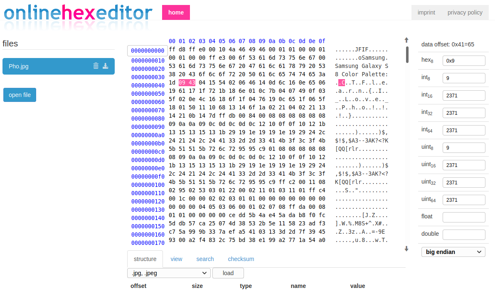

## Pho Is Tasty!
The main idea finding the flag is see Hex Dump!

#### Step-1:
After I downloaded `Pho.jpg`, I tried using `strings`, `binwalk`, etc. But no much luck.

`strings Pho.jpg` output:
```
oSamsung
Samsung Galaxy S8 Color Palette:
)$,$!$,$A3--3AK?<?K[QQ[rlr
)$,$!$,$A3--3AK?<?K[QQ[rlr
```
I didn't get any idea of the encryption here.
#### Step-2:
So, I tried to see [Hex Dump](https://www.onlinehexeditor.com/) of the `Pho.jpg`, I got the flag there.



#### Step-3:
Finally the flag becomes: 

[comment]: <> (`CTFlearn{I_Love_Pho!!!}`)
