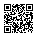
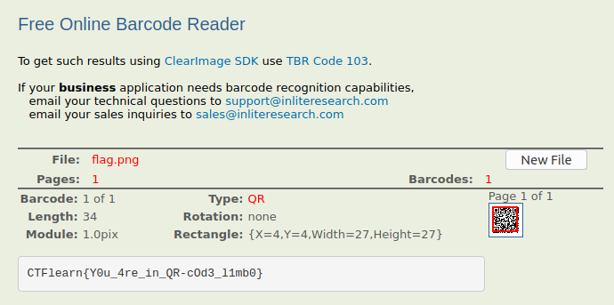

## QR-code inception
The main idea of getting the flag is using cv2, zbar libraries to get decoded message.

#### Step-1:
After downloading `inception.png`, I tried to scan it, But for some reason, it showed me errors. But we can obviously see some grid on it. So I tried to zoom in using Stegsolver.


#### Step-2:
Now we see many qr codes in it, we need script to scan them all and give us the clue. So, I wrote up this script `qr.py` to get the flag.

```python
import base64
import cv2
import numpy as np
import zbar

scale = 300
scanner = zbar.Scanner()

def scan(img):
    img = np.bitwise_xor(img, ~img[0,0])
    img = cv2.resize(img, (scale * 5, scale * 5), interpolation = cv2.INTER_AREA)
    ret = scanner.scan(img)
    return ret[0].data if ret else b''

img = cv2.imread('inception.png', cv2.IMREAD_GRAYSCALE)
w,h = img.shape
msg = b''.join([scan(img[y:y+scale, x:x+scale]) for y in range(0, h, scale) for x in range(0,w,scale)])
print("Decoded message: " + msg)
```
I ran it by `python qr.py`

#### Step-3:
I got this output:

```bash
Decoded message: CTFlearn is a dream. Is Cobb still dreaming? I hope you scripted the retrieval of this message because "we need to go deeper"... iVBORw0KGgoAAAANSUhEUgAAACUAAAAlAQAAAADt5R2uAAAAsUlEQVR4nGP4DwQ/GDDJD9IGDhUM369x3q9g+BJgdBFIRvQEAsnwKUD290uzgOIfREOBav5/jgSq/3T2sQtQb865mgqGn46fGn4wfLE/eqaC4VN/1jkgmVFdBdR7sripguGPMrfeD4ZvUhO1fjD8+P73JlAl58YDQPEfGxf/YPjuFcQINPOLSRHQDULCQUCRG6olQL0xh9lBLpkXAVQfM6sU6IYrr78B1Yga2mFzP5gEAB2SgeETXS+JAAAAAElFTkSuQmCC
```

#### Step-4:
It was Base64 encrypted and so I decrypted it online [here](https://codebeautify.org/base64-to-image-converter) to get an image.




#### Step-5:
Scanning it online at: https://online-barcode-reader.inliteresearch.com/ gave me the flag.



#### Step-6:
Finally, the flag becomes:
`CTFlearn{Y0u_4re_in_QR-cOd3_l1mb0}`