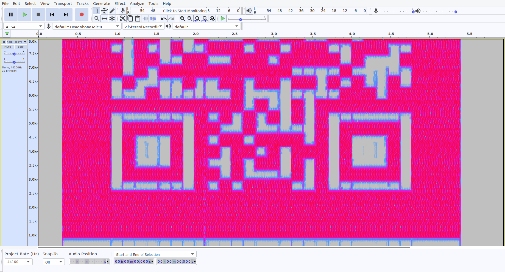
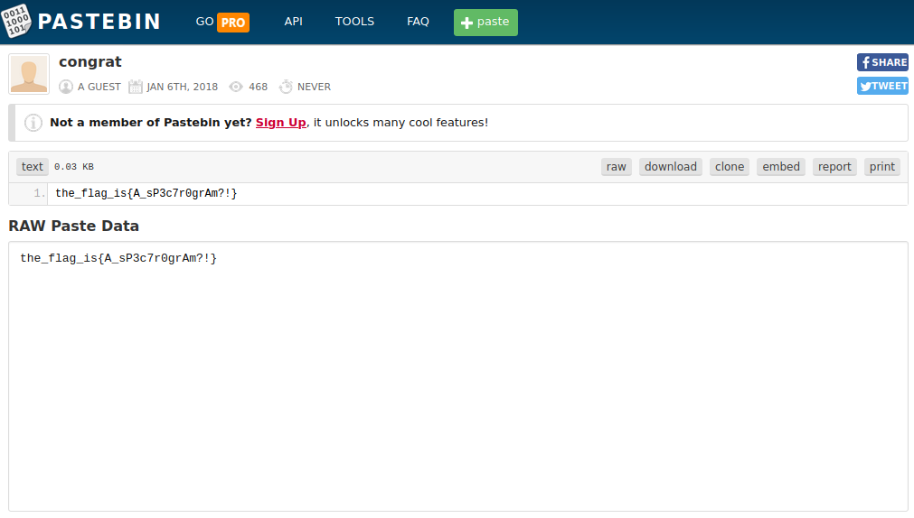

## Seeing is believing
The main idea of finding the flag is basic Stego Skills.

#### Step-1:
After I downloaded `help.me`, I tried `file help.me` on it. I got this:

```bash
help.me: Ogg data, Vorbis audio, mono, 44100 Hz, ~110000 bps, created by: Xiph.Org libVorbis 
I (1.3.3)
```
This is a `ogg` format file.
#### Step-2:
So, I just make a copy and convert its extension to `help (copy).ogg`. 
When I played it, it was nothing some gitters.

#### Step-3:
So, I opened it in [Audacity](https://www.audacityteam.org/). Normally, here I check out in Spectogram view. 




#### Step-4:
We clearly got a barcode there. When I scanned it online, I was taken to this URL: https://pastebin.com/zhEhyp3G


#### Step-6:
I found the flag there.



#### Step-8:
Finally, the flag becomes: 
`the_flag_is{A_sP3c7r0grAm?!}`