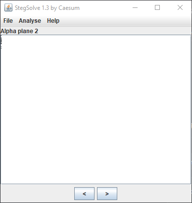
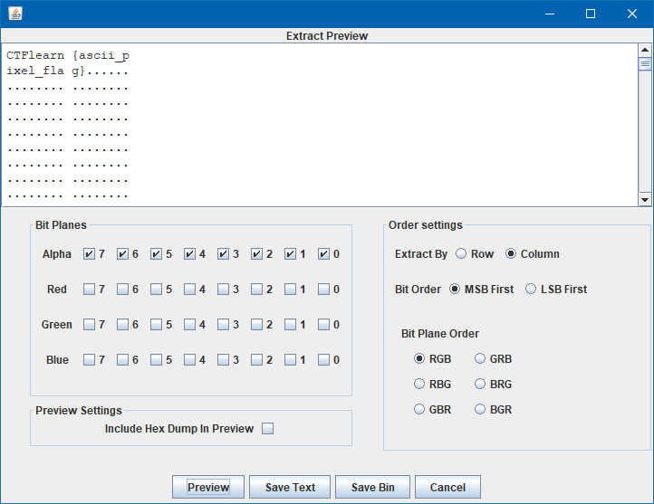

## Smiling ASCII Alternative Solution
The main idea is to find the flag with Stegsolve.

#### Step-1:
We are given [`smiling.png`](./smiling.png). 

#### Step-2:
If we look at the image in [Stegsolve](https://github.com/eugenekolo/sec-tools/tree/master/stego/stegsolve/stegsolve), we can see interference in all alpha, blue, and green planes:

#### Step-3:
If there's interference that means data can be extracted based on the interference. Go to Analyze > Data Extract:

#### Step-4:
The flag is:
`CTFlearn{ascii_pixel_flag}`