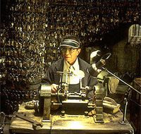

## The Keymaker
The main idea finding the flag using some forensics and Crypto concepts.


#### Step-1:
After we download `The-Keymaker.jpg`, we try to open and see the flag and check if we find any.



#### Step-2:
I tried simple techniques and easily found answer when we send the command:

`strings The-Keymaker.jpg`

I and got this as output:

```
JFIF
CTFlearn{TheKeymakerIsK00l}
b3BlbnNzbCBlbmMgLWQgLWFlcy0yNTYtY2JjIC1pdiBTT0YwIC1LIFNPUyAtaW4gZmxhZy5lbmMg
LW91dCBmbGFnIC1iYXNlNjQKCml2IGRvZXMgbm90IGluY2x1ZGUgdGhlIG1hcmtlciBvciBsZW5n
dGggb2YgU09GMAoKa2V5IGRvZXMgbm90IGluY2x1ZGUgdGhlIFMwUyBtYXJrZXIKCg==
CmmtaSHhAsK9pLMepyFDl37UTXQT0CMltZk7+4Kaa1svo5vqb6JuczUqQGFJYiycY
 , #&')*)
-0-(0%()(
((((((((((((((((((((((((((((((((((((((((((((((((((
RR=,Q
)n}}
ZY&H
1(m{iR
!AE3
J/>E	
]m4us
/fuY
*0W[
YDkR&
-(ah!
X*EY#
}up07%
FPvV
[T);
uZD 
[vK4
O>a\U
L.dY[
KK$h
Xn6<|
_@[O
+$KIQ;
A7~B.A]B
l-nvQ
i+2n
+K0x
{b:W
h4Yf7s;
1RTI
ZR^C
[Yf#r
U]+U4
{5}n
%SAL
IJ4\7
>_@M=<b
F*%J
X\lp
f=+kn9
e+^@
S`=+
JZ$D
W,C;
Se=I
!I7$/
?\UIn
Jjm.
Kn/ql>#'o
F\z>y
npU7
{D[i
-:*C
-;5r
%Ciw
V],Is
,I ~
hE#Q
2jz/(
itO,
	er.](
sj9d
biF:
o~19F.-
m.uX,rzB.
PI8xc
MR,(_T`
|;jOoS$
jJ7e
'Y$]
znRK
C$+8
,!~th}
7nS*
~pE=
dMh&
KsHw
QTHZ
S-~u=
:RB9uFr
ER	#
A-.kx%
/qm_,FZN
j#2*
@,T[{
Ksri
6kYB
1u23
e%I/Q
%fJm
tM:v
M+I<M
)!U5
@e%H
tHrw
U_G_
^m4B
ue:E
gR/.
6b	!v
*-40E-S
;`)FN
MU.KN
JN%F
+%MD3E*M*K
`W)'
Q$04
:IpKI^2
5ev$o
CRb4
fS|<`S
iMD1RT
`bX>
yU^[K
NAP_r
WFZN
iU_=B
 jwX
R=:F
2g4m
Vu=9
&jHj
Q,h6>
$j`7
xTGP
Y]MZ
KQ--
CH:T
8hGt{
%)tG
'*Z`
BQZ1
aQY&^
pl}(N
K[_MBFZ
IM!Q
TZiQ
<h5!I
NNAwM
`JQ%$ut
"Uid1
U59m8S
4;Lup
PD4GO
r*TU
po~7
o},}
yQe!_
&3:E
!+E,
#9g |
E=_e*h
9A"O
:4P_2
(:k,
9id$I
05An
YfqT
IW]CQOB
RW^&
$)<0
8QoQ[
-l/|
l,nB
~xx)(
@Art
h+s\
d9>aUQqU
M9S\
3eA,
S\q0
A6;x
bU4u
LoIR
%)5&
w#X 
5B7Q
AEO*UH
~IN{
P56c]B:
&PdR
Uw[s}
&&#{
{q|,t
_[WV%
(Bm,
/jDh
U$t.
%aUX
8}WSSf
TRg4b
bUbs
-9J1Q
2*et
GSJL&	
nHym
JQ9mE
SWQ+
T}6_
U)SB|K
*j`i+
YuFqS
]GMm
T#>_C
M$4u'
qwWK
OVnF
.HBm~
SFw$
pRrT
	$iY@0
 T%X
Hg%!`
HUtz
 ^Pw'
Qtm2U
9_LW
&WHh
^?l_
DUPv
e-%Q
T$NA
#3Lf
LqV-
|uY%j
\Xsl
Wmz}B
P0se
:^u.
-[-,3
 iceW
IuvC
A`.	
K$YlO
plqx
!hAq
;[H$
VIA$
uacp
K?/ht
Qi%@\
C"V4OK
[QY#
gRKCRY
/b6+
7$JI
M^eQ
9k"c"@
`} l
-Q42
F6ui*E
#Tj(
%%Na
;Q9\
1@_},C
+=E=B
6zzy"
h{!"
olNj
Wc$TY}fT
STjfD
/#gNC
uV_C[)
n,Bj
?dy[
LT}T
jcHB
T7QV
*(N\
GVi9NV
)i"U
DZ_H
-;'Q
P,ZA
m~|b5r@
()*^
,B^7
u'wI
M=k"
1OQv6
iNSJ
M9c&
_QM]
WGlll-r
s4	4
\o|w
WSM)e
Pwhj
jzw.
u4tU9
&YL	K1S
?BlF:c
Qmt@*
iY]9
#m#"6
PEP@
mrpV
```

#### Step-4:
Try the flag and it is incorrect. Now the following part looks like Base64 encryption:
```
b3BlbnNzbCBlbmMgLWQgLWFlcy0yNTYtY2JjIC1pdiBTT0YwIC1LIFNPUyAtaW4gZmxhZy5lbmMg
LW91dCBmbGFnIC1iYXNlNjQKCml2IGRvZXMgbm90IGluY2x1ZGUgdGhlIG1hcmtlciBvciBsZW5n
dGggb2YgU09GMAoKa2V5IGRvZXMgbm90IGluY2x1ZGUgdGhlIFMwUyBtYXJrZXIKCg==
```

When we decode it online, we get the following:
```
openssl enc -d -aes-256-cbc -iv SOF0 -K SOS -in flag.enc -out flag -base64

iv does not include the marker or length of SOF0

key does not include the S0S marker
```


#### Step-5:

This is a hint, the flag is encoded with AES-256-CBC, then we need to find 128 bits of _iv_ and 256 bits of _key_ to decode and find the flag.

#### Step-6:

Open the image with hex editor, we find SOF0 with `0xff` `0xc0`, the length of SOF0 is `0x00` `0x11`.

If you don't have idea of mark identifiers of an image, refer below:

http://vip.sugovica.hu/Sardi/kepnezo/JPEG%20File%20Layout%20and%20Format.htm

If you're too lazy to identify the components yourself:

https://cyber.meme.tips/jpdump

Then, the _iv_ is: `0800be00c803011100021101031101ff`

#### Step-7:

We find S0S with `0xff` `0xda`, the _key_ is:

`000c03010002110311003f00f9766bfc44beda8f3f5c031b92cb0e92d6bdc952`

#### Step-8:

We have a comment left, this is the encoded flag:

`mmtaSHhAsK9pLMepyFDl37UTXQT0CMltZk7+4Kaa1svo5vqb6JuczUqQGFJYiycY`

#### Step-9:

According to the command, input we need to create a `flag.enc` which includes the above comment.

So, finally the contents of flag.enc become : `mmtaSHhAsK9pLMepyFDl37UTXQT0CMltZk7+4Kaa1svo5vqb6JuczUqQGFJYiycY`

#### Step-10:
According to previous given Base64 decryption, we have put the following command:

`openssl enc -d -aes-256-cbc -iv 0800be00c803011100021101031101ff -K 000c03010002110311003f00f9766bfc44beda8f3f5c031b92cb0e92d6bdc952 -in flag.enc -out flag -base64`

#### Step-11:

This will create a file `flag` in the same directory and then we can read the contents by just `cat flag`

#### Step-12:
Finally the flag becomes:

[comment]: <> (`CTFlearn{Ne0.TheMatrix}`)
