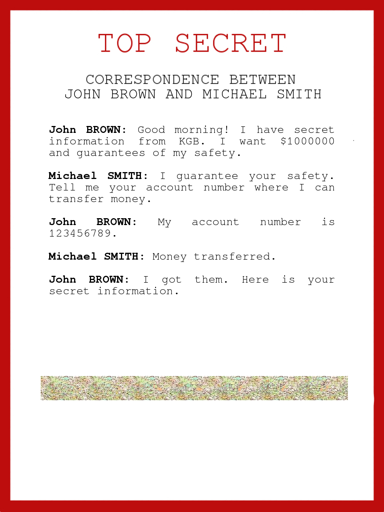
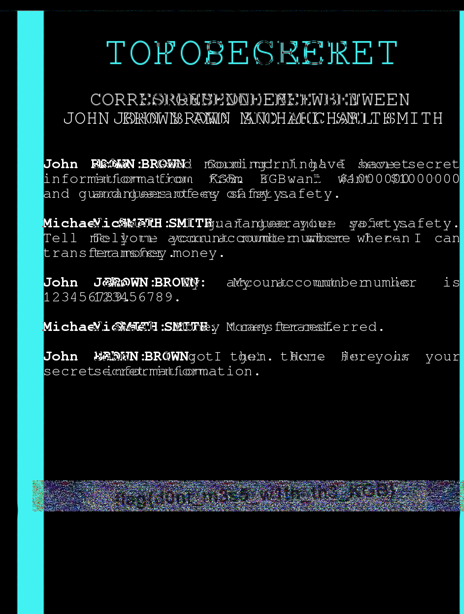

## The adventures of Boris Ivanov. Part 1.
The main idea finding the flag is to tangle image RGB filters with Stegsolver.

#### Step-1:
After downloading `Boris_Ivanov_1.jpg` from the cloud, I tried all basic Forensics Techniques, but I got nothing.

NULL. NATA. ZIP.

#### Step-2:

I tried to use the Stegsolver application. For those who don't have it, can get the script from here:

https://github.com/zardus/ctf-tools/tree/master/stegsolve

After installation is complete, running `./stegsolver.jar` will launch the application. 

#### Step-3:

After reading the challenge again and again we can notice the word KGB may bay relate to Steganography by RGB.  

In Stegsolver, there are 1000 offsets possible. 

#### Step-4:
Luckily, after analyzing the image, I started to filter backwards and got flag at <strong>898</strong> offset.

I got the flag there. 

#### Step-5:
Finally the flag becomes:
`flag{d0nt_m3s5_w1th_th3_KGB}`