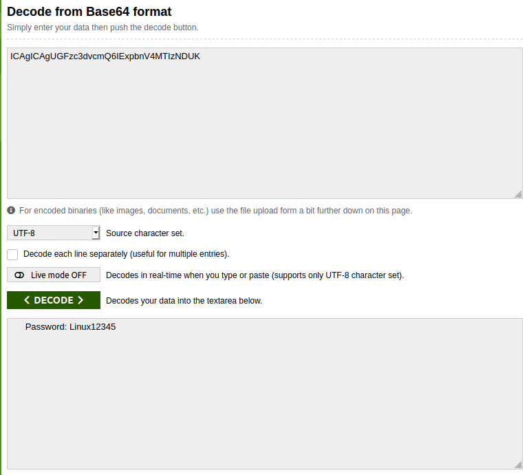

## Tux!
The main idea finding the flag is get flag using basic Stego skills.

#### Step-1:
After I downloaded `Tux.jpg`, I tried using `strings`, `binwalk`, etc. But no much luck.


`strings Tux.jpg` output:
```
JFIF
'ICAgICAgUGFzc3dvcmQ6IExpbnV4MTIzNDUK
```
#### Step-2:
I got this Base64 encrypted string there, which I tried to decode [here](https://www.base64decode.org/).



#### Step-3:
So, next I tried `binwalk Tux.jpg` and got this:
```bash
DECIMAL       HEXADECIMAL     DESCRIPTION
--------------------------------------------------------------------------------
0             0x0             JPEG image data, JFIF standard 1.01
5488          0x1570          Zip archive data, encrypted at least v1.0 to extract, compressed size: 39, uncompressed size: 27, name: flag
5679          0x162F          End of Zip archive, footer length: 22
```

So to unzip the files, I used `binwalk -e Tux.jpg` and got a directory named: `_Tux.jpg.extracted`.
It contained `flag` (Encrypted obviously.)


#### Step-4:
So, then I used the password: `Linux12345`, we got after decoding the Base64 string.

Voila! I got the flag.
#### Step-5:
Finally the flag becomes: 

[comment]: <> (`CTFlearn{Linux_Is_Awesome}`)

