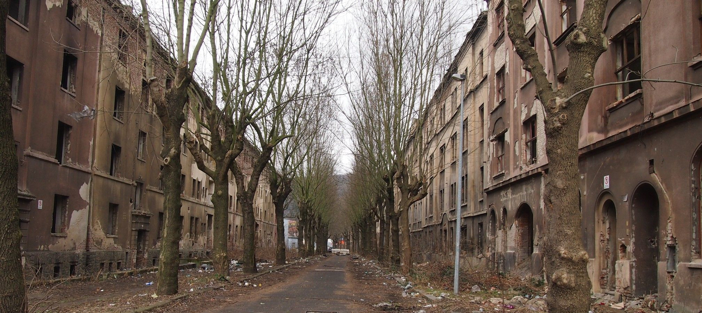
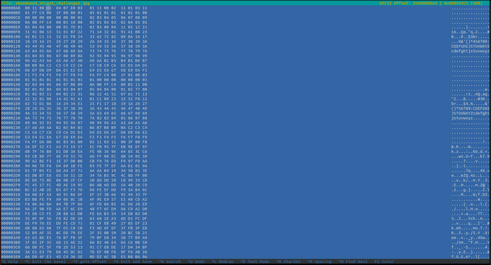
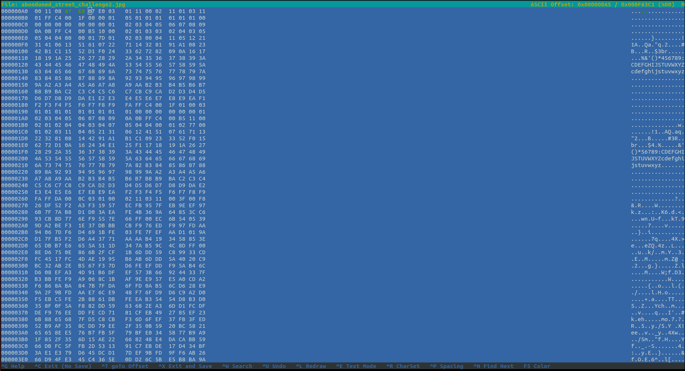
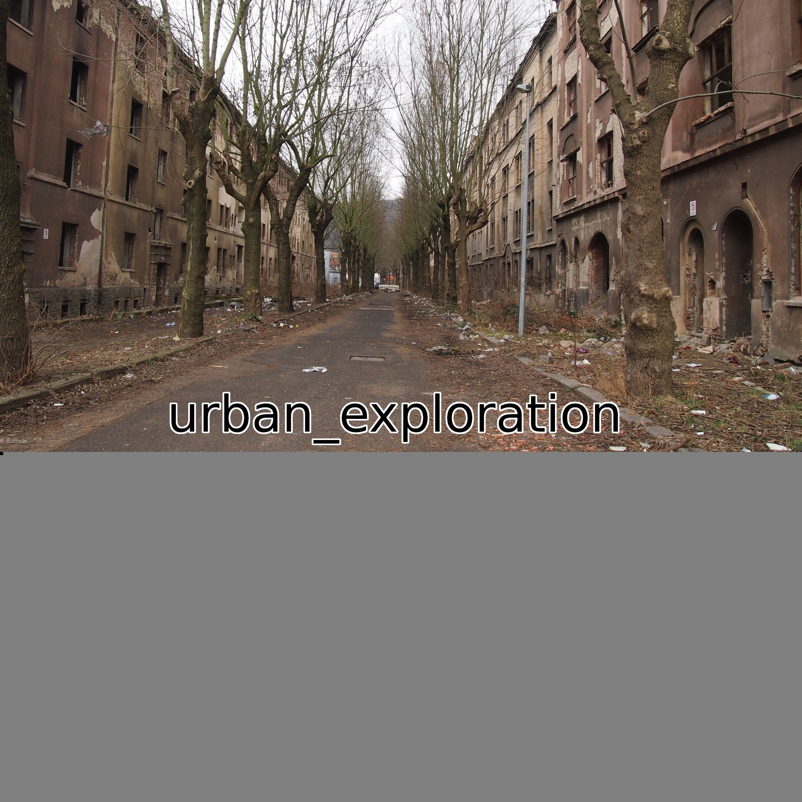

## abandoned place
The main idea to find the flag is to use manipulate the dimensions.

#### Step-1:
We are given `abondoned_street_challenge2.jpg`. 



#### Step-2:
To get the basic idea on the image given, I used [Exiftool](https://exiftool.org/).
I tried to use `exiftool abondoned_street_challenge2.jpg` and I got the following output:

```bash
ExifTool Version Number         : 11.88
File Name                       : abondoned_street_challenge2.jpg
Directory                       : .
File Size                       : 985 kB
File Modification Date/Time     : 2020:12:26 20:18:04+05:30
File Access Date/Time           : 2020:12:26 20:20:28+05:30
File Inode Change Date/Time     : 2021:01:12 17:00:34+05:30
File Permissions                : rw-r--r--
File Type                       : JPEG
File Type Extension             : jpg
MIME Type                       : image/jpeg
JFIF Version                    : 1.01
Resolution Unit                 : inches
X Resolution                    : 314
Y Resolution                    : 314
Image Width                     : 2016
Image Height                    : 900
Encoding Process                : Baseline DCT, Huffman coding
Bits Per Sample                 : 8
Color Components                : 3
Y Cb Cr Sub Sampling            : YCbCr4:4:4 (1 1)
Image Size                      : 2016x900
Megapixels                      : 1.8
```

#### Step-3:
The dimensions given are `2016 x 900`, 
```bash
[?] 104 bytes of extra data after image end (IEND), offset = 0xe6cd
extradata:0         .. text: "RGlkIHlvdSBrbm93IHRoYXQgcGl4ZWxzIGFyZSwgbGlrZSB0aGUgYXNjaWkgdGFibGUsIG51bWJlcmVkIGZyb20gMCB0byAyNTU/Cg=="
b3,abgr,lsb,xy      .. file: very old 16-bit-int little-endian archive
b1,rgba,lsb,yx      .. file: AIX core file
b1,abgr,lsb,yx      .. file: AIX core file fulldump 32-bit
b8,g,lsb,yx         .. text: "CTFlearn{ascii_pixel_flag}"
b8,a,lsb,yx         .. text: "CTFlearn{ascii_pixel_flag}"
b4,r,lsb,yx,prime   .. file: AIX core file fulldump 32-bit
b4,g,lsb,yx,prime   .. file: AIX core file 32-bit
b8,g,lsb,yx,prime   .. text: "Flancixla"
b8,a,lsb,yx,prime   .. text: "Flancixla"
```

#### Step-4:
In order to alter the dimensions, we have to use a hex editor. So, I tried `hexeditor abondoned_street_challenge2.jpg`. [Hex values of 900 and 2016 are `03 84` and `07 E0` respectively].



So, I find the `03 84` hex code and replace it with `07 E0` as follows:




#### Step-5:
I got the following image after making the changes in the hex code:



#### Step-6:
Finally, the flag becomes:
`CTFlearn{urban_exploration}`