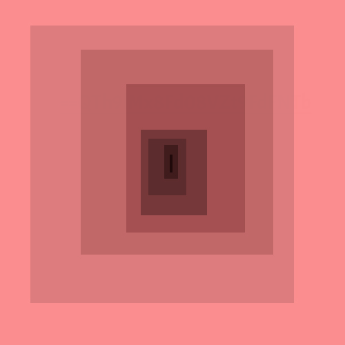
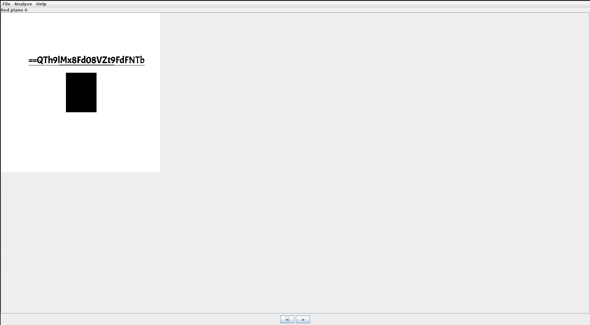
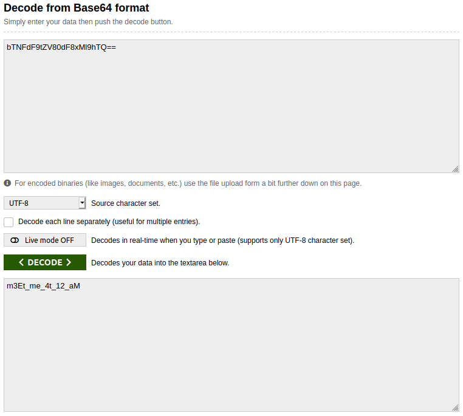

## Ambush Mission
The main idea of finding the flag is Stego and Crypto skills.

#### Step-1:
After I downloaded `clue.png`, I checked for basic commands like `strings`, `binwalk`, etc.

#### Step-2:
Now, I used [Stegsolve](https://github.com/zardus/ctf-tools/tree/master/stegsolve) to check for any hints.

#### Step-3:
Luckily, in Red Plane 0, I got encrypted string: `==QTh9lMx8Fd08VZt9FdFNTb`. 

If you have slight idea of Base64 encrypted strings, they end with `=` or `==`. So, this string was clearly reversed.

#### Step-4:
I reversed it online at: https://codebeautify.org/reverse-string

#### Step-5:
Finally again Base64. Looked small. Hoped it would be flag.

#### Step-6:
Finally, the flag becomes: 
`flag{m3Et_me_4t_12_aM}`
