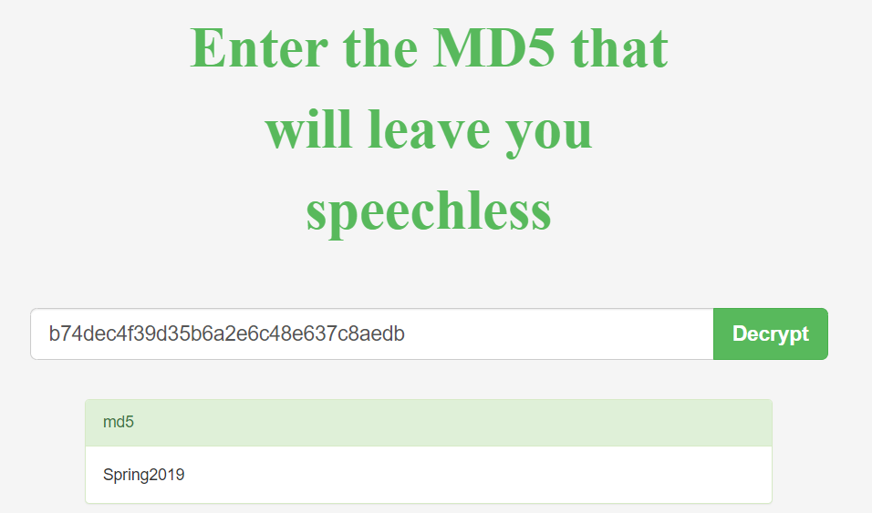

## Android, run!
The main idea finding the flag analyzing the APK file provided.

#### Step-1:
After we download `Run.apk` from the cloud, we try to understand what is the content.

#### Step-2:
The contents at `ByteCode/com/MainActivity.java` lead us to this following piece of code using any online APK decompiler:

```java
package com.example.secondapp;
 
import android.os.Bundle;
import android.view.View;
import android.widget.EditText;
import android.widget.TextView;
import androidx.appcompat.app.AppCompatActivity;
import org.apache.commons.codec.digest.DigestUtils;
 
public class MainActivity extends AppCompatActivity {
    @Override  // androidx.appcompat.app.AppCompatActivity
    protected void onCreate(Bundle arg1) {
        super.onCreate(arg1);
        this.setContentView(0x7F09001C);  // layout:activity_main
    }
 
    public void submitPassword(View arg4) {
        EditText v4 = (EditText)this.findViewById(0x7F070037);  // id:editText2
        if(DigestUtils.md5Hex(v4.getText().toString()).equalsIgnoreCase("b74dec4f39d35b6a2e6c48e637c8aedb")) {
            ((TextView)this.findViewById(0x7F07008A)).setText("Success! CTFlearn{" + v4.getText().toString() + "_is_not_secure!}");  // id:textView
        }
    }
}
```
#### Step-3:
Just how authentication works in other applications or APK workflows, here as well - the app is calling a login layout file (can see line 4-5):

```xml
<?xml version="1.0" encoding="UTF-8"?>
<androidx.constraintlayout.widget.ConstraintLayout android:layout_height="-1" android:layout_width="-1" xmlns:android="http://schemas.android.com/apk/res/android" xmlns:app="http://schemas.android.com/apk/res-auto">
  <Button android:id="@id/button" android:layout_height="-2" android:layout_marginBottom="160.0dp" android:layout_marginRight="160.0dp" android:layout_width="-2" android:onClick="submitPassword" android:text="@string/button" app:layout_constraintBottom_toBottomOf="0" app:layout_constraintEnd_toEndOf="0"/>
  <EditText android:ems="10" android:hint="@string/username" android:id="@id/editText" android:inputType="0x81" android:layout_height="-2" android:layout_marginBottom="20.0dp" android:layout_marginLeft="96.0dp" android:layout_width="-2" app:layout_constraintBottom_toTopOf="@id/editText2" app:layout_constraintStart_toStartOf="0"/>
  <EditText android:ems="10" android:hint="@string/password" android:id="@id/editText2" android:inputType="0x21" android:layout_height="-2" android:layout_marginBottom="32.0dp" android:layout_marginLeft="96.0dp" android:layout_width="-2" app:layout_constraintBottom_toTopOf="@id/button" app:layout_constraintStart_toStartOf="0"/>
  <TextView android:id="@id/textView" android:layout_height="-2" android:layout_marginBottom="276.0dp" android:layout_marginLeft="175.0dp" android:layout_marginRight="179.0dp" android:layout_marginTop="86.0dp" android:layout_width="-2" android:text="@string/welcome_please_enter_the_password_for_the_flag" android:textSize="30.0sp" app:layout_constraintBottom_toTopOf="@id/editText" app:layout_constraintEnd_toEndOf="0" app:layout_constraintStart_toStartOf="0" app:layout_constraintTop_toTopOf="0"/>
</androidx.constraintlayout.widget.ConstraintLayout>
```

#### Step-4:
After finding that a user can enter the credentials (username & password), and then click the button to submit. The button binds an `onClick()` function to invoke `submitPassword()` function in `MainActivity()`.

```java
public void submitPassword(View arg4) {
    EditText v4 = (EditText)this.findViewById(0x7F070037);  // id:editText2
if(DigestUtils.md5Hex(v4.getText().toString()).equalsIgnoreCase("b74dec4f39d35b6a2e6c48e637c8aedb")) {
        ((TextView)this.findViewById(0x7F07008A)).setText("Success! CTFlearn{" + v4.getText().toString() + "_is_not_secure!}");  // id:textView
    }
}
```

#### Step-6:
Decoding the above given MD5 hash `b74dec4f39d35b6a2e6c48e637c8aedb` [here](https://www.somd5.com/), gives us the following:



The final flag from the 4th line in above code gives us CTFlearn{"hash"_is_not_secure!}

#### Step-7:
Finally the flag becomes:
`CTFlearn{Spring2019_is_not_secure!}`
