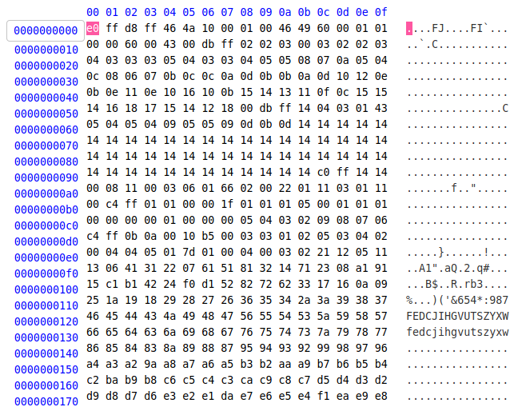
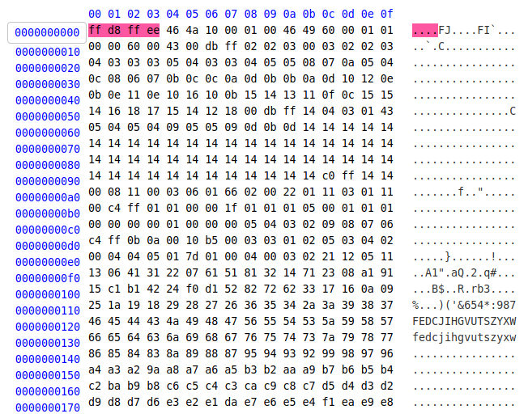
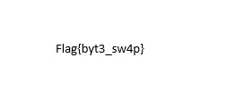

## F1L3 M1X3R
The main idea to find the flag is fixing the signatures of images in Hex Dump.

#### Step-1:
After downloading the `fl4g.jpeg` image, I tried basic `strings`, `binwalk`, etc. But couldn't find anything special.

But in the description some nice link for all signatures of different files was given:
https://en.wikipedia.org/wiki/List_of_file_signatures

#### Step-2:
So, to check the given file's format I checked it online [here](https://www.onlinehexeditor.com/).
It was mixed. 



So I fixed it with the reference from Wiki website given above.



#### Step-3:
Hoping that this would work, even this didn't open the `fl4g.jpeg`.

#### Step-4:
So, I checked the hex dump and observed that the values were all present only scrambled. With an offset of every 4 bytes, they were arranged in reverse order! 
`FF D8 FF E0` had been reversed to read `E0 FF D8 FF` and so on for every 4 bytes of the signature. Fixing just the signature wouldn't suffice the challenge because it's possible this reversing had happened to the entire file.

#### Step-5:
So, I wrote a script `exploit.py`, where we read the hex dump in required and correct way and possibly rearrange in order to get the flag.

```py
#! usr/bin/python3

# Reading the bytes
with open("fl4g.jpeg", "rb") as file:
    OFFSET = 4    
    sig_rev = b""
    sig_read  = bytearray(file.read(OFFSET))

# Cyclic Reversing 
    while sig_read:
        sig_rev += sig_read[::-1]
        sig_read = file.read(OFFSET)
# Flag Output        
    with open("Flag.jpeg", "wb") as newfile:
        newfile.write(sig_rev)
```
#### Step-6:
When I ran this as `python3 exploit.py`, I got this new image `Flag.jpeg`, which had the flag in it.



#### Step-7:
Finally, the flag becomes:
`Flag{byt3_sw4p}`