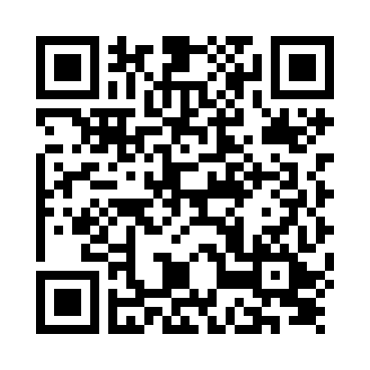
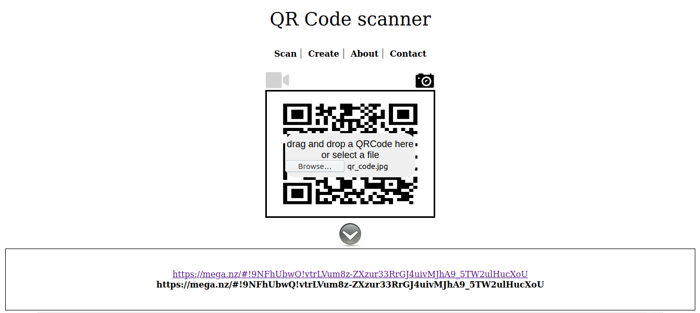

## QR Code v2
The main idea finding the flag is common sense.

#### Step-1:
After downloading `qr_code.jpg` from the cloud, I tried to scan it online.

#### Step-2:
I followed the URL:  https://webqr.com/

I got the following result:

We get another link from here: 

[https://mega.nz/#!9NFhUbwQ!vtrLVum8z-ZXzur33RrGJ4uivMJhA9_5TW2ulHucXoU](https://mega.nz/#!9NFhUbwQ!vtrLVum8z-ZXzur33RrGJ4uivMJhA9_5TW2ulHucXoU)
#### Step-3:
So I went to above URL and downloaded `Flag.txt`.

It had the flag in it. That's it.

#### Step-4:
Finally the flag becomes:
`CTF{2_QR_4_U}`