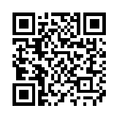
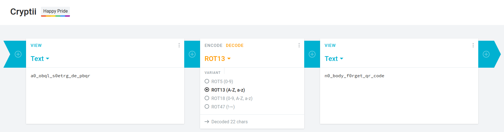

## QR Code
The main idea finding the flag is to decrypt multiple encryptions.

#### Step-1:
After downloading, `qrcode.39907201.png` from the cloud, my first try was to scan it online:

#### Step-2:
I followed the URL:  https://webqr.com/index.html

I got the following message after the scan:

Message: `c3ludCB2ZiA6IGEwX29icWxfczBldHJnX2RlX3BicXI=`.

This was clearly Base64 encrypted, which can be said by terminating '='. 

#### Step-3:
So, I tried at this URL and tried to decode the flag: https://www.base64decode.org/

I got the following result:

Decryption: `synt vf : a0_obql_s0etrg_de_pbqrgo`.

I tried this as the flag, but unfortunately, it didn't work out. Now I thought that, this message itself could be encrypted and I got a sense of ROT13 there. If anyone is unaware of ROT13 encryption, they can check out here: https://en.wikipedia.org/wiki/ROT13

#### Step-5:
So for ROT13 decryption, I followed this URL: https://cryptii.com/.

I got the following result:

Voila, we have it.
#### Step-6:

Finally the flag becomes:
`n0_body_f0rget_qr_code`