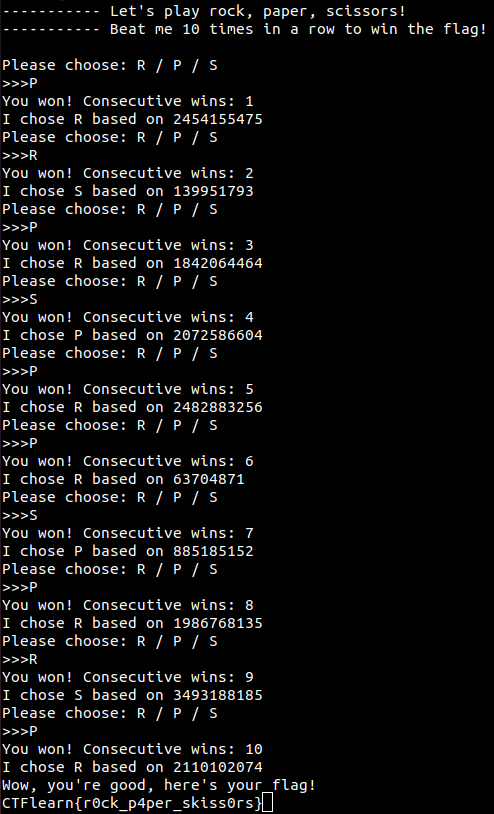

## Rock Paper Scissors
The main idea of finding the flag is recognizing a pattern to pwn.

#### Step-1:
After I input `nc 138.197.193.132 5001`, I tried various combinations to complete challenge.

#### Step-2:
It is easy to find a pattern because the pwn machine chooses a specific 'R' or 'P' or 'S' corresponding to a number. So, after matching the numbers with the machine's choice, I got this pattern to get 10 consecutive wins.

```
PRPSPPSPRP
```



#### Step-3:
Finally, the flag becomes: 
`CTFlearn{r0ck_p4per_skiss0rs}`